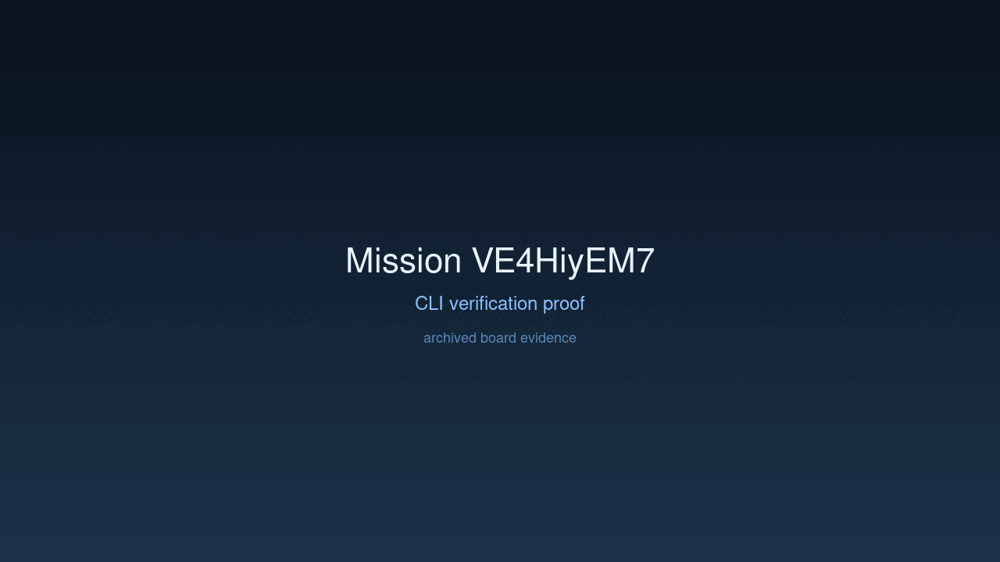

# Mission: Boot Sequence Credit System

## Documents

| Document | Description |
|----------|-------------|
| [CHARTER.md](CHARTER.md) | Mission goals, constraints, and halting rules |
| [LOG.md](LOG.md) | Decision journal and session digest |
| [record-cli.gif](record-cli.gif) | CLI verification proof |
| [verification.gif](verification.gif) | High-dimension verification proof |

## Verification Proof

