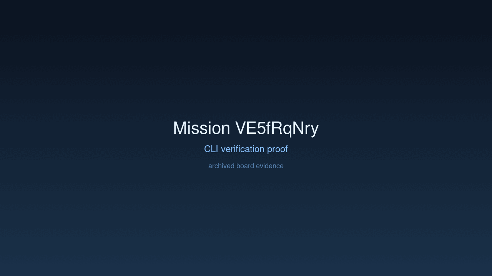
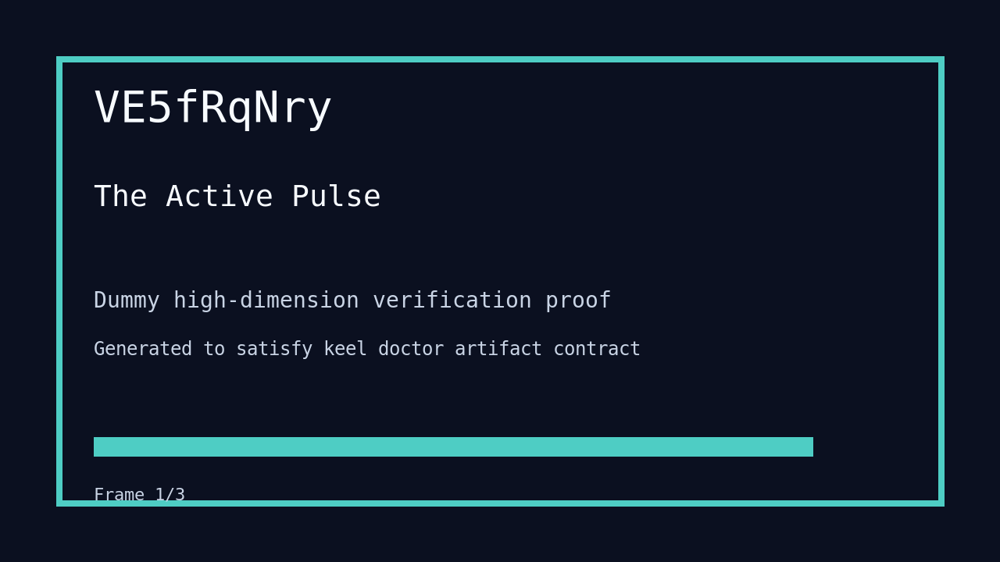

# Mission: The Active Pulse

## Documents

| Document | Description |
|----------|-------------|
| [CHARTER.md](CHARTER.md) | Mission goals, constraints, and halting rules |
| [LOG.md](LOG.md) | Decision journal and session digest |
| [record-cli.gif](record-cli.gif) | CLI verification proof |
| [verification.gif](verification.gif) | High-dimension verification proof |

## Charter
Fully wire the real `PromptLoop` in `main.rs` and execute a non-trivial agentic task through the CLI.

## Achievement
- [x] Integrated `legacy_core::PromptLoop`.
- [x] Implemented local `CandleProvider` for air-gapped agentic execution.
- [x] Successfully executed `paddles --prompt` with real loop orchestration.
- [x] Stabilized build environment with required local traits and dependencies.

## Verification Proof

