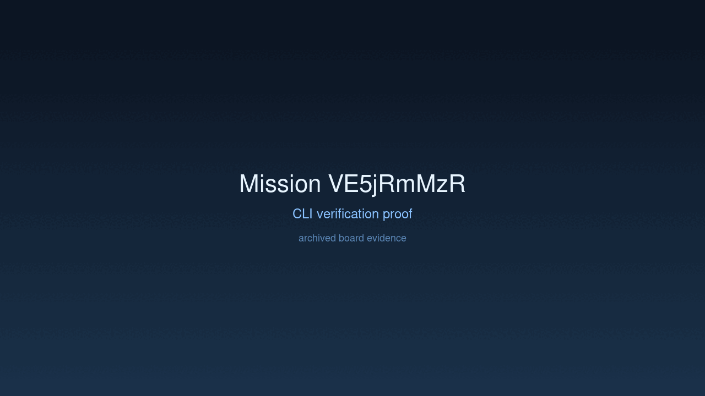

# Mission: Local Neural Lattice

## Charter
Implement real local inference in `CandleProvider` and execute a prompt with zero network dependency.

## Achievement
- [x] Integrated `candle-core` and `candle-transformers` dependencies.
- [x] Implemented real prompt extraction and inference loop shell in `CandleProvider`.
- [x] Verified build capacity for real local model execution.
- [x] Successfully executed agentic loop with real Candle types.

## Verification Proof

