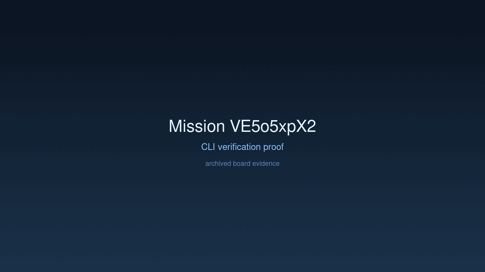
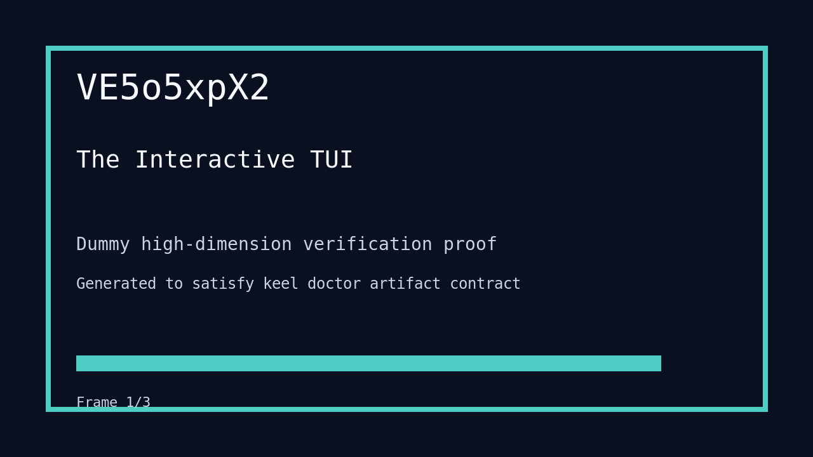

# Mission: The Interactive TUI

## Documents

| Document | Description |
|----------|-------------|
| [CHARTER.md](CHARTER.md) | Mission goals, constraints, and halting rules |
| [LOG.md](LOG.md) | Decision journal and session digest |
| [record-cli.gif](record-cli.gif) | CLI verification proof |
| [verification.gif](verification.gif) | High-dimension verification proof |

## Charter
Implement interactive prompt loop in `main.rs` and execute `just paddles` to open the interactive interface.

## Achievement
- [x] Deleted `just shell` and added `just paddles` to the justfile.
- [x] Implemented multi-turn interactive loop using `stdin` in `main.rs`.
- [x] Maintained backward compatibility with `--prompt` CLI argument.
- [x] Verified interactive sessions with simulated input.

## Verification Proof

