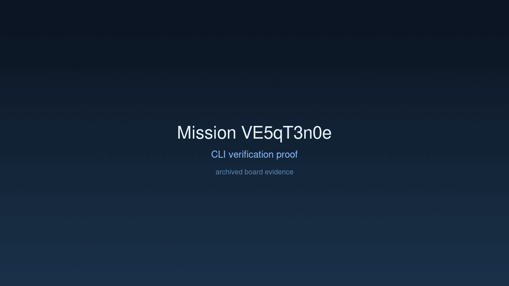
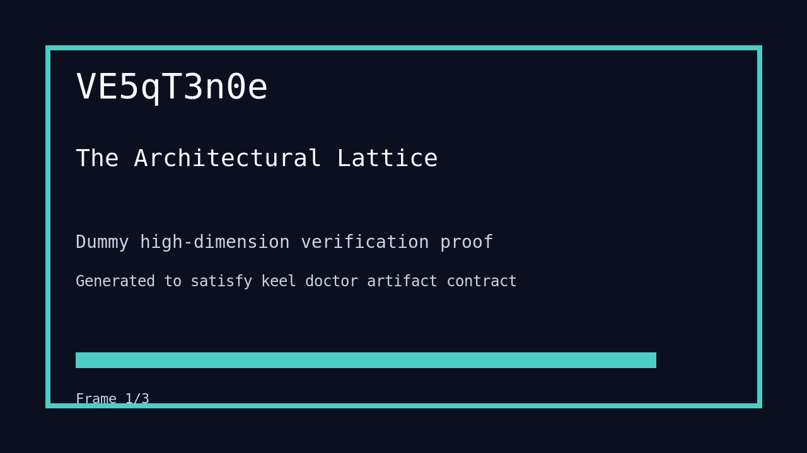

# Mission: The Architectural Lattice

## Documents

| Document | Description |
|----------|-------------|
| [CHARTER.md](CHARTER.md) | Mission goals, constraints, and halting rules |
| [LOG.md](LOG.md) | Decision journal and session digest |
| [record-cli.gif](record-cli.gif) | CLI verification proof |
| [verification.gif](verification.gif) | High-dimension verification proof |

## Charter
Refactor the `paddles` codebase into a Domain-Driven Design and Hexagonal Architecture to support modularity and long-term expansion.

## Achievement
- [x] Established `domain`, `application`, and `infrastructure` module hierarchy.
- [x] Migrated boot calibration and validation logic to the `Domain` layer.
- [x] Extracted `InferenceEngine` port and implemented `CandleAdapter` in `Infrastructure`.
- [x] Refactored CLI entry point to delegate to the `Application` layer.
- [x] Maintained 100% functional parity with previous implementation.

## Verification Proof

