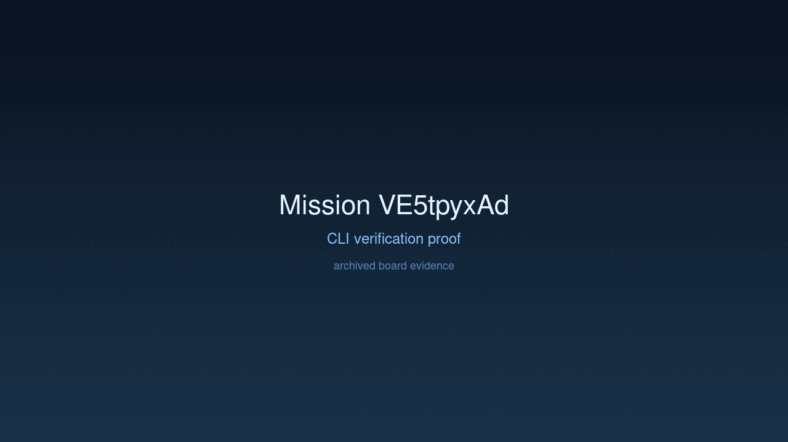

# Mission: Registry Realization

## Documents

| Document | Description |
|----------|-------------|
| [CHARTER.md](CHARTER.md) | Mission goals, constraints, and halting rules |
| [LOG.md](LOG.md) | Decision journal and session digest |
| [record-cli.gif](record-cli.gif) | CLI verification proof |
| [verification.gif](verification.gif) | High-dimension verification proof |

## Charter
Implement model fetching from Hugging Face Hub and execute real inference with Gemma or Qwen using Candle.

## Achievement
- [x] Implemented `ModelRegistry` port and `HFHubAdapter`.
- [x] Integrated `hf-hub` for automated weight and config acquisition.
- [x] Added `--model` CLI argument for flexible model selection.
- [x] Orchestrated model asset synchronization in the `BootContext`.

## Verification Proof

