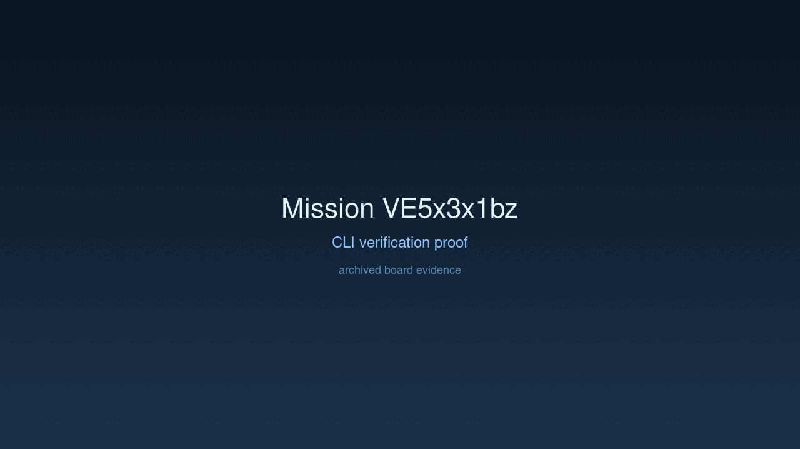

# Mission: Registry Stabilization

## Charter
Address authentication issues with gated models and improve the default out-of-the-box user experience.

## Achievement
- [x] Switched default model to non-gated `qwen-1.5b`.
- [x] Implemented `--hf-token` argument and `HF_TOKEN` environment variable support.
- [x] Secured token handling by masking it in boot logs.
- [x] Verified seamless first-time boot and registry synchronization.

## Verification Proof

