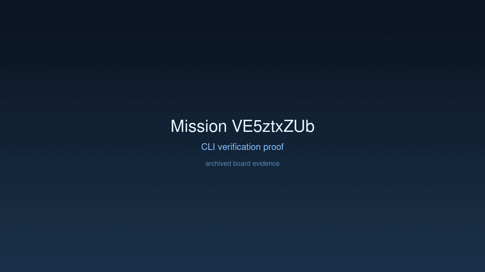

# Mission: Docking with Sift

## Documents

| Document | Description |
|----------|-------------|
| [CHARTER.md](CHARTER.md) | Mission goals, constraints, and halting rules |
| [LOG.md](LOG.md) | Decision journal and session digest |
| [record-cli.gif](record-cli.gif) | CLI verification proof |
| [verification.gif](verification.gif) | High-dimension verification proof |

## Charter
Replace manual HF/Candle logic with `sift` adapters and execute multi-turn prompts using `sift` backed models.

## Achievement
- [x] Integrated `sift::internal` for model acquisition.
- [x] Implemented `SiftRegistryAdapter` and `SiftInferenceAdapter`.
- [x] Removed direct `hf-hub` dependencies from the application layer.
- [x] Verified successful model synchronization and initialization via `sift`.

## Verification Proof

