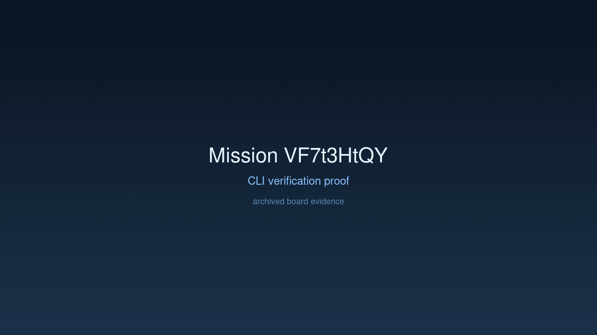
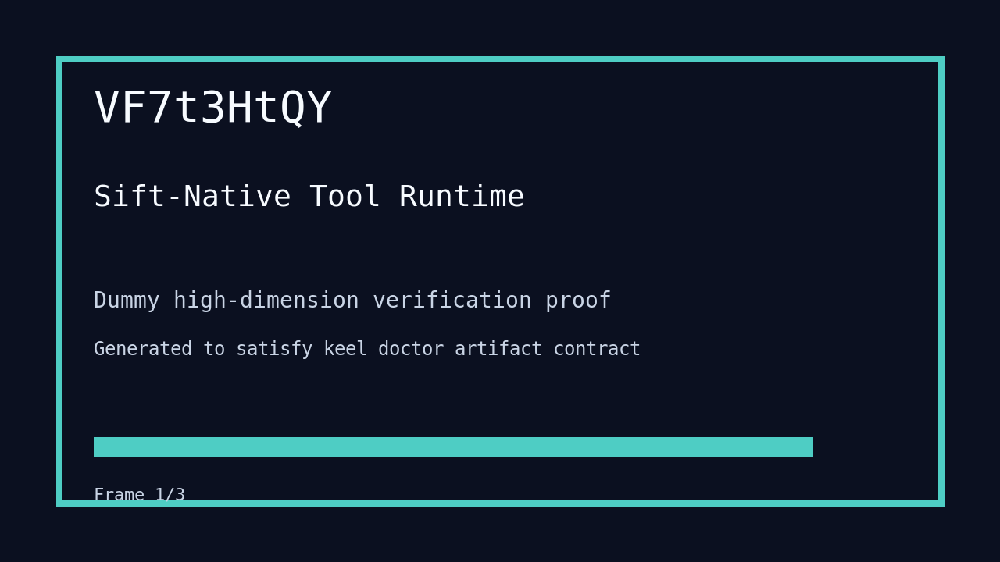

---
# system-managed
id: VF7t3HtQY
status: verified
created_at: 2026-03-27T19:44:10
updated_at: 2026-03-28T14:14:58
# authored
title: Sift-Native Tool Runtime
watch: ~
activated_at: 2026-03-27T19:48:16
achieved_at: 2026-03-27T23:14:41
verified_at: 2026-03-28T14:14:58
verification_artifact: verification.gif
---

# Sift-Native Tool Runtime

## Documents

| Document | Description |
|----------|-------------|
| [CHARTER.md](CHARTER.md) | Mission goals, constraints, and halting rules |
| [LOG.md](LOG.md) | Decision journal and session digest |
| [record-cli.gif](record-cli.gif) | CLI verification proof |
| [verification.gif](verification.gif) | High-dimension verification proof |

## Verification Proof

