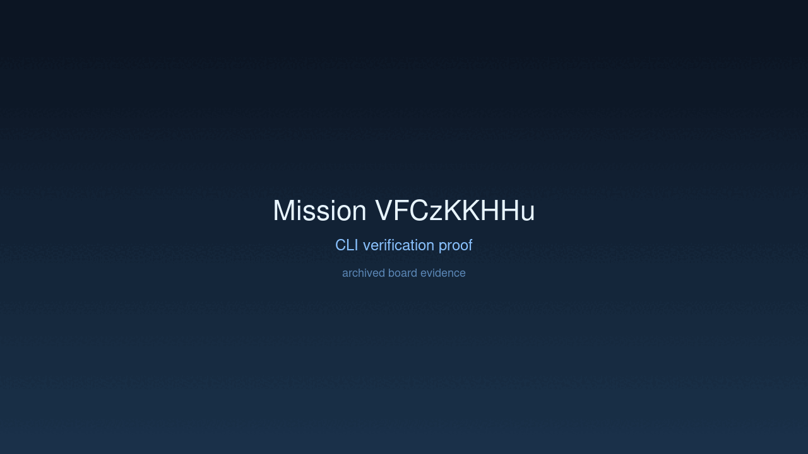
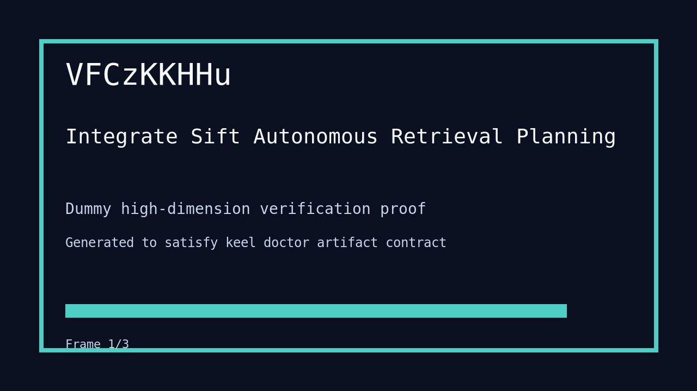

---
# system-managed
id: VFCzKKHHu
status: verified
created_at: 2026-03-28T16:40:27
updated_at: 2026-03-28T18:04:51
# authored
title: Integrate Sift Autonomous Retrieval Planning
watch: ~
activated_at: 2026-03-28T16:43:23
achieved_at: 2026-03-28T17:24:07
verified_at: 2026-03-28T18:04:51
---

# Integrate Sift Autonomous Retrieval Planning

## Documents

| Document | Description |
|----------|-------------|
| [CHARTER.md](CHARTER.md) | Mission goals, constraints, and halting rules |
| [LOG.md](LOG.md) | Decision journal and session digest |
| [record-cli.gif](record-cli.gif) | CLI verification proof |
| [verification.gif](verification.gif) | High-dimension verification proof |

## Verification Proof

