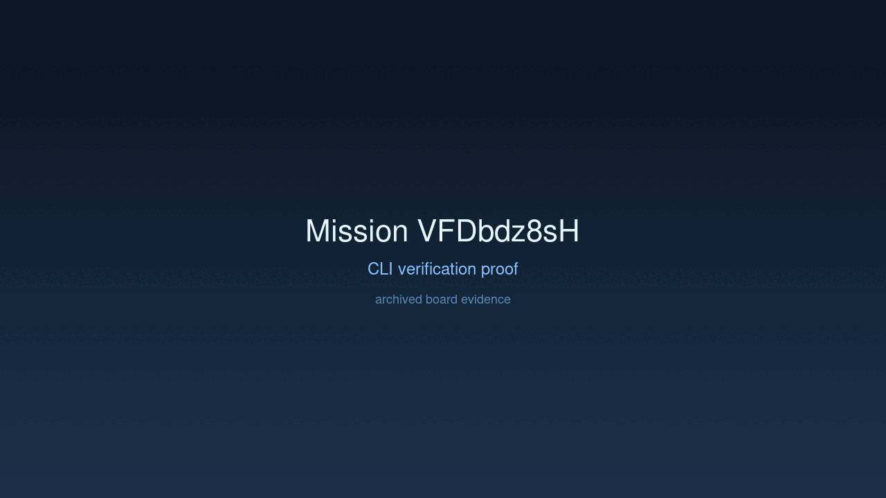

---
# system-managed
id: VFDbdz8sH
status: verified
created_at: 2026-03-28T19:12:39
updated_at: 2026-03-28T19:53:18
# authored
title: Codex-Style Interactive TUI For Paddles
watch: ~
activated_at: 2026-03-28T19:15:10
achieved_at: 2026-03-28T19:42:21
verified_at: 2026-03-28T19:53:18
---

# Codex-Style Interactive TUI For Paddles

## Documents

| Document | Description |
|----------|-------------|
| [CHARTER.md](CHARTER.md) | Mission goals, constraints, and halting rules |
| [LOG.md](LOG.md) | Decision journal and session digest |
| [record-cli.gif](record-cli.gif) | CLI verification proof |
| [verification.gif](verification.gif) | High-dimension verification proof |

## Verification Proof

