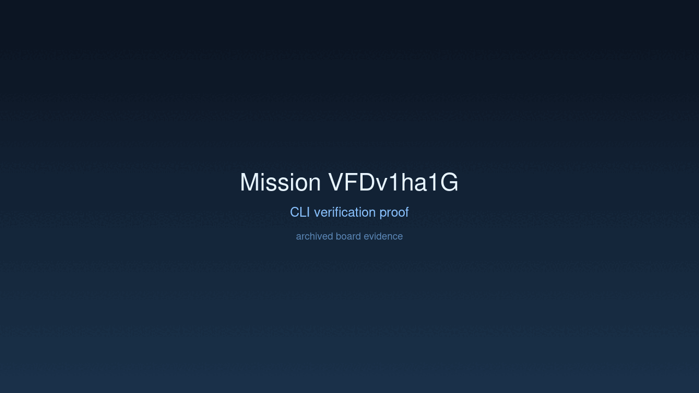
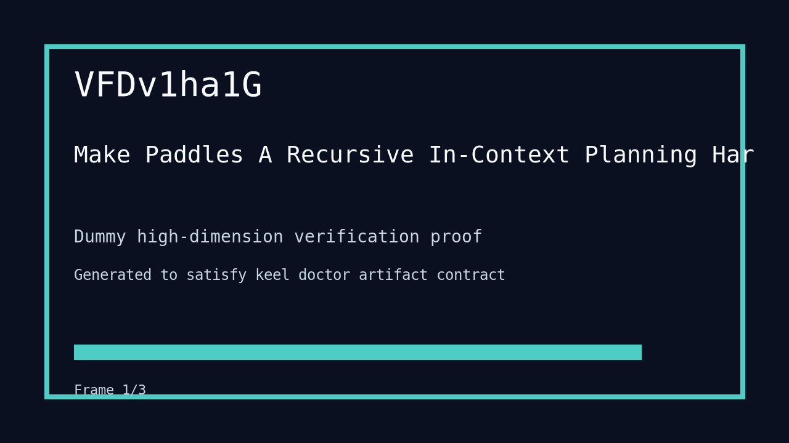

---
# system-managed
id: VFDv1ha1G
status: verified
created_at: 2026-03-28T20:29:39
updated_at: 2026-03-29T08:42:04
# authored
title: Make Paddles A Recursive In-Context Planning Harness
watch: ~
activated_at: 2026-03-28T20:37:02
achieved_at: 2026-03-28T21:21:17
verified_at: 2026-03-29T08:42:04
---

# Make Paddles A Recursive In-Context Planning Harness

## Documents

| Document | Description |
|----------|-------------|
| [CHARTER.md](CHARTER.md) | Mission goals, constraints, and halting rules |
| [LOG.md](LOG.md) | Decision journal and session digest |
| [record-cli.gif](record-cli.gif) | CLI verification proof |
| [verification.gif](verification.gif) | High-dimension verification proof |

## Verification Proof

