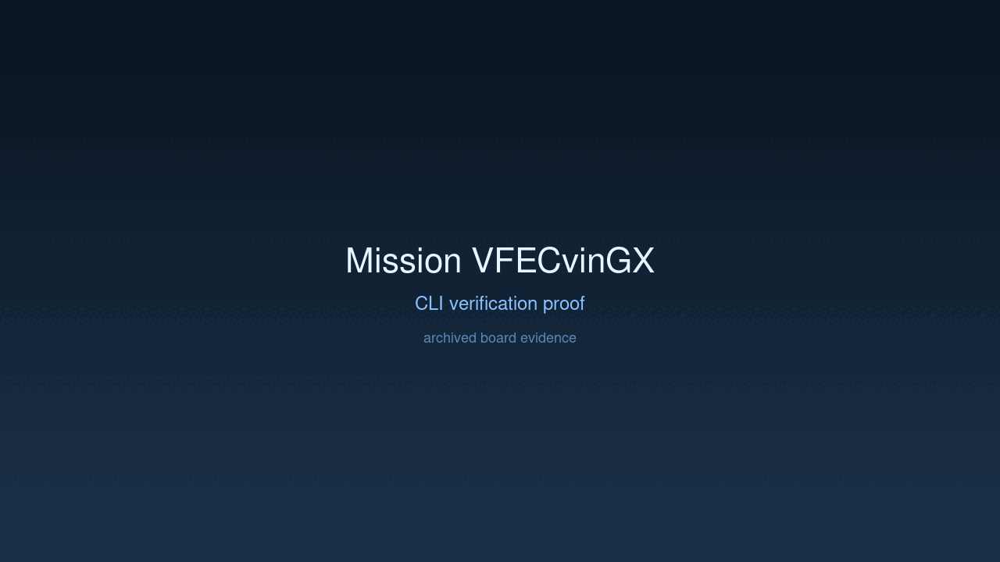
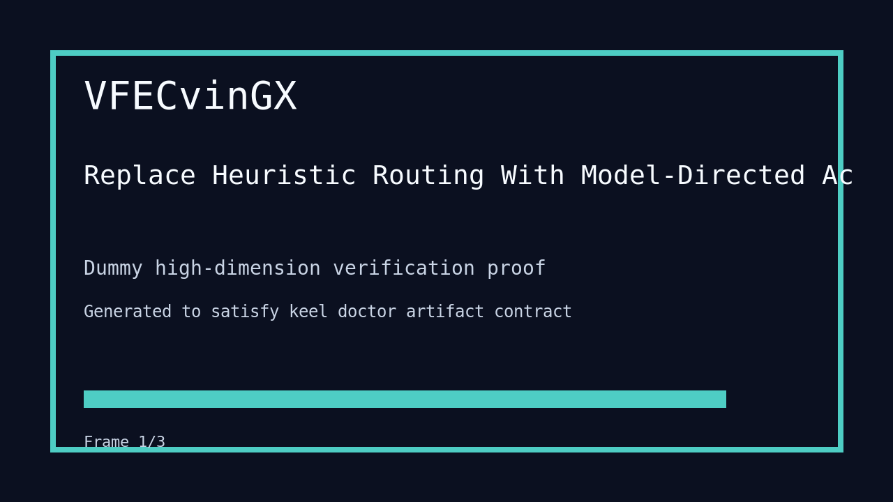

---
# system-managed
id: VFECvinGX
status: verified
created_at: 2026-03-28T21:40:46
updated_at: 2026-03-29T08:42:04
# authored
title: Replace Heuristic Routing With Model-Directed Action Selection
watch: ~
activated_at: 2026-03-28T21:48:12
achieved_at: 2026-03-29T08:38:42
verified_at: 2026-03-29T08:42:04
verification_artifact: verification.gif
---

# Replace Heuristic Routing With Model-Directed Action Selection

## Documents

| Document | Description |
|----------|-------------|
| [CHARTER.md](CHARTER.md) | Mission goals, constraints, and halting rules |
| [LOG.md](LOG.md) | Decision journal and session digest |
| [record-cli.gif](record-cli.gif) | CLI verification proof |
| [verification.gif](verification.gif) | High-dimension verification proof |

## Verification Proof

