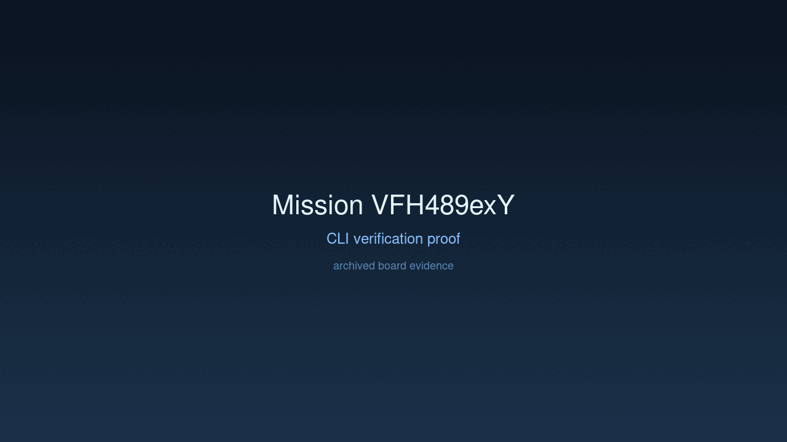

---
# system-managed
id: VFH489exY
status: verified
created_at: 2026-03-29T09:24:37
updated_at: 2026-03-29T10:09:27
# authored
title: Define Transit-Aligned Trace Recorder Boundary
watch: ~
activated_at: 2026-03-29T09:44:05
achieved_at: 2026-03-29T09:57:55
verified_at: 2026-03-29T10:09:27
---

# Define Transit-Aligned Trace Recorder Boundary

## Documents

| Document | Description |
|----------|-------------|
| [CHARTER.md](CHARTER.md) | Mission goals, constraints, and halting rules |
| [LOG.md](LOG.md) | Decision journal and session digest |
| [record-cli.gif](record-cli.gif) | High-dimension verification proof |

## Verification Proof

