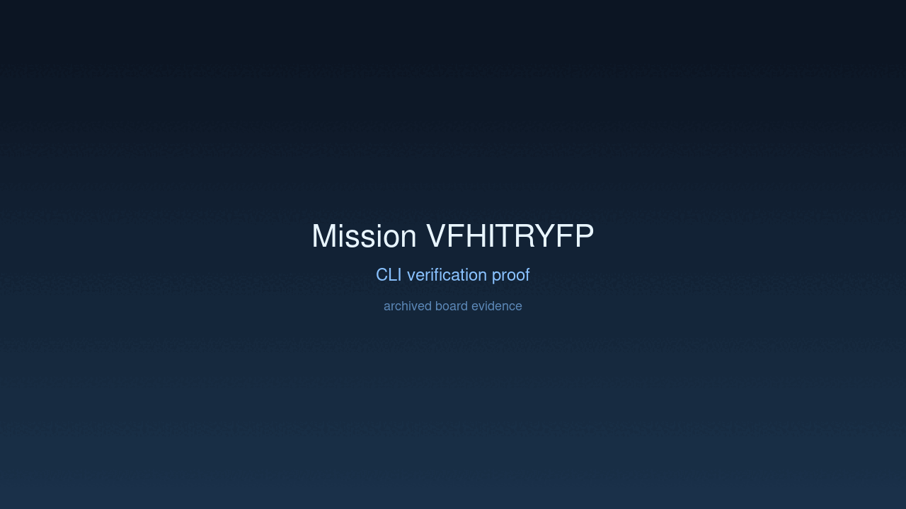
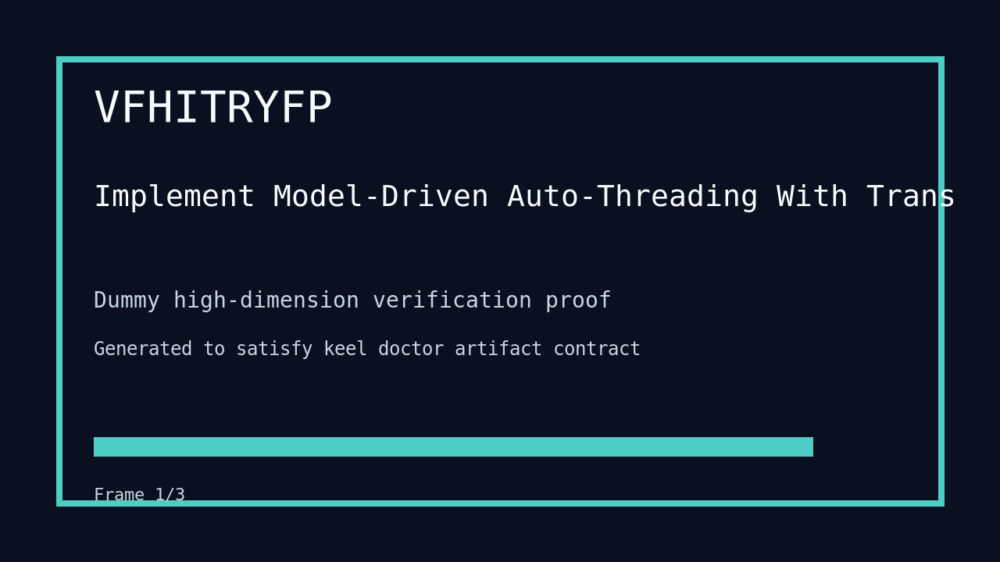

---
# system-managed
id: VFHITRYFP
status: verified
created_at: 2026-03-29T10:21:36
updated_at: 2026-03-29T19:42:11
# authored
title: Implement Model-Driven Auto-Threading With Transit
watch: ~
activated_at: 2026-03-29T10:25:12
achieved_at: 2026-03-29T11:58:43
verified_at: 2026-03-29T19:42:11
---

# Implement Model-Driven Auto-Threading With Transit

## Documents

| Document | Description |
|----------|-------------|
| [CHARTER.md](CHARTER.md) | Mission goals, constraints, and halting rules |
| [LOG.md](LOG.md) | Decision journal and session digest |
| [record-cli.gif](record-cli.gif) | CLI verification proof |
| [verification.gif](verification.gif) | High-dimension verification proof |

## Verification Proof

