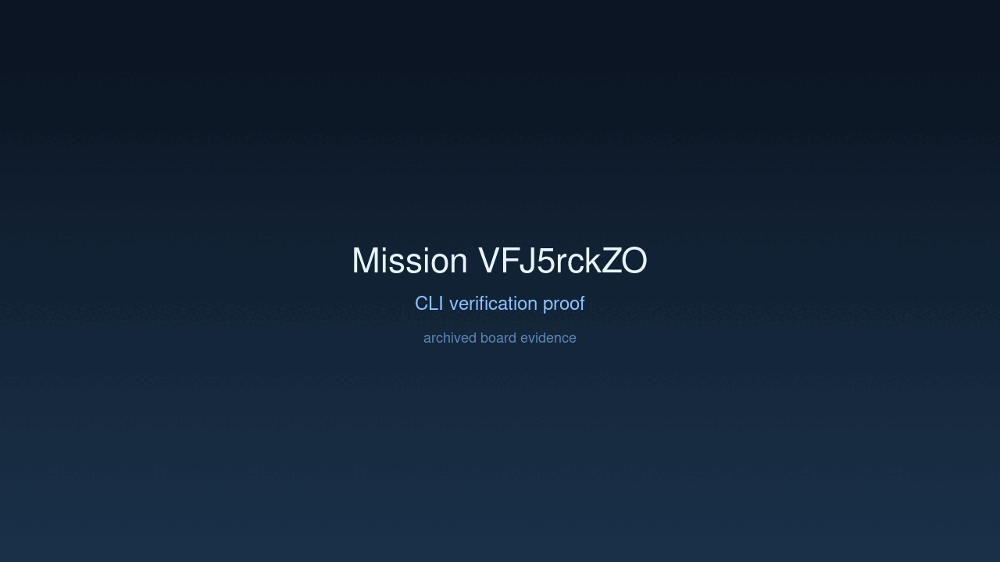
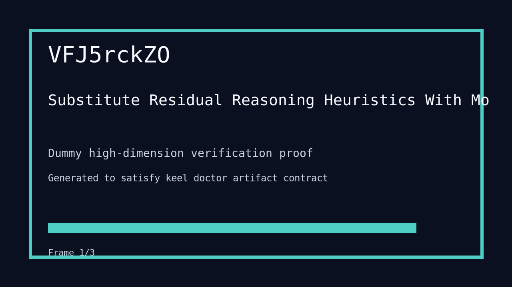

---
# system-managed
id: VFJ5rckZO
status: verified
created_at: 2026-03-29T17:44:03
updated_at: 2026-03-29T19:42:13
# authored
title: Substitute Residual Reasoning Heuristics With Model-Judged Interpretation And Retrieval
watch: ~
activated_at: 2026-03-29T17:47:05
achieved_at: 2026-03-29T18:28:19
verified_at: 2026-03-29T19:42:13
---

# Substitute Residual Reasoning Heuristics With Model-Judged Interpretation And Retrieval

## Documents

| Document | Description |
|----------|-------------|
| [CHARTER.md](CHARTER.md) | Mission goals, constraints, and halting rules |
| [LOG.md](LOG.md) | Decision journal and session digest |
| [record-cli.gif](record-cli.gif) | CLI verification proof |
| [verification.gif](verification.gif) | High-dimension verification proof |

## Verification Proof

