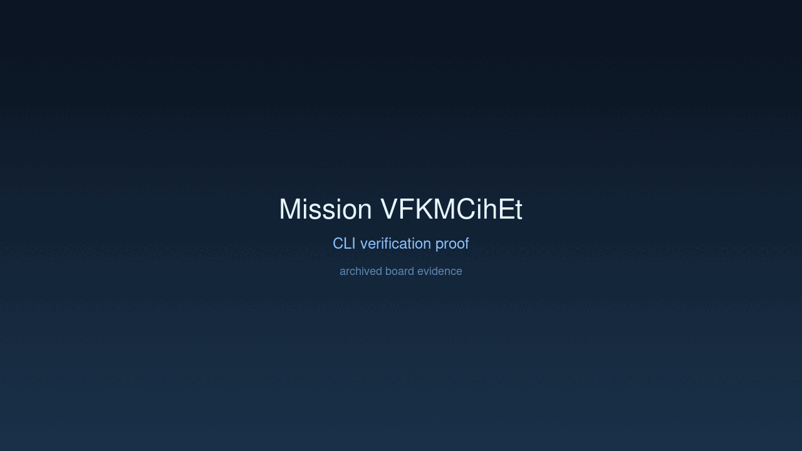
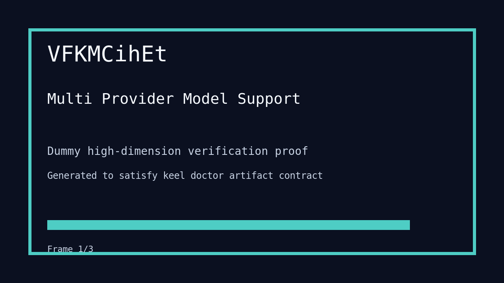

---
# system-managed
id: VFKMCihEt
status: verified
created_at: 2026-03-29T22:55:14
updated_at: 2026-03-30T07:00:01
# authored
title: Multi Provider Model Support
watch: ~
activated_at: 2026-03-30T06:50:57
achieved_at: 2026-03-30T07:00:01
verified_at: 2026-03-30T07:00:01
---

# Multi Provider Model Support

## Documents

| Document | Description |
|----------|-------------|
| [CHARTER.md](CHARTER.md) | Mission goals, constraints, and halting rules |
| [LOG.md](LOG.md) | Decision journal and session digest |
| [record-cli.gif](record-cli.gif) | CLI verification proof |
| [verification.gif](verification.gif) | High-dimension verification proof |

## Verification Proof

