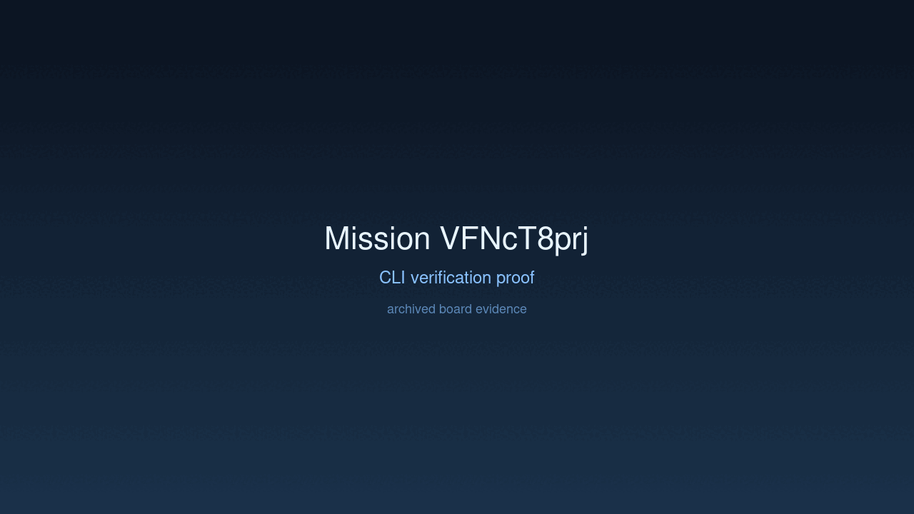

---
# system-managed
id: VFNcT8prj
status: verified
created_at: 2026-03-30T12:18:39
updated_at: 2026-03-30T12:40:25
# authored
title: Step Timing Baselines
watch: ~
activated_at: 2026-03-30T12:24:45
achieved_at: 2026-03-30T12:40:25
verified_at: 2026-03-30T12:40:25
---

# Step Timing Baselines

## Documents

| Document | Description |
|----------|-------------|
| [CHARTER.md](CHARTER.md) | Mission goals, constraints, and halting rules |
| [LOG.md](LOG.md) | Decision journal and session digest |
| [record-cli.gif](record-cli.gif) | High-dimension verification proof |

## Verification Proof

