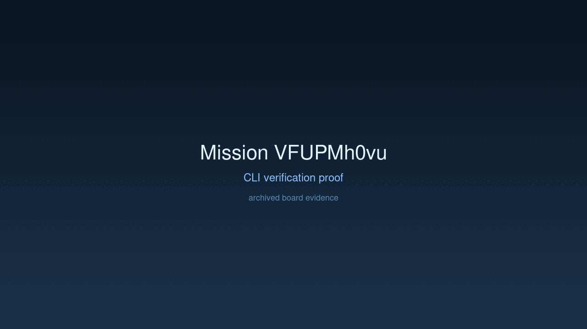

---
# system-managed
id: VFUPMh0vu
status: verified
created_at: 2026-03-31T16:10:31
updated_at: 2026-03-31T16:35:10
# authored
title: Adaptive Interpretation Context Refinement
watch: ~
activated_at: 2026-03-31T16:24:53
achieved_at: 2026-03-31T16:34:56
verified_at: 2026-03-31T16:35:10
---

# Adaptive Interpretation Context Refinement

## Documents

| Document | Description |
|----------|-------------|
| [CHARTER.md](CHARTER.md) | Mission goals, constraints, and halting rules |
| [LOG.md](LOG.md) | Decision journal and session digest |
| [record-cli.gif](record-cli.gif) | High-dimension verification proof |

## Verification Proof

