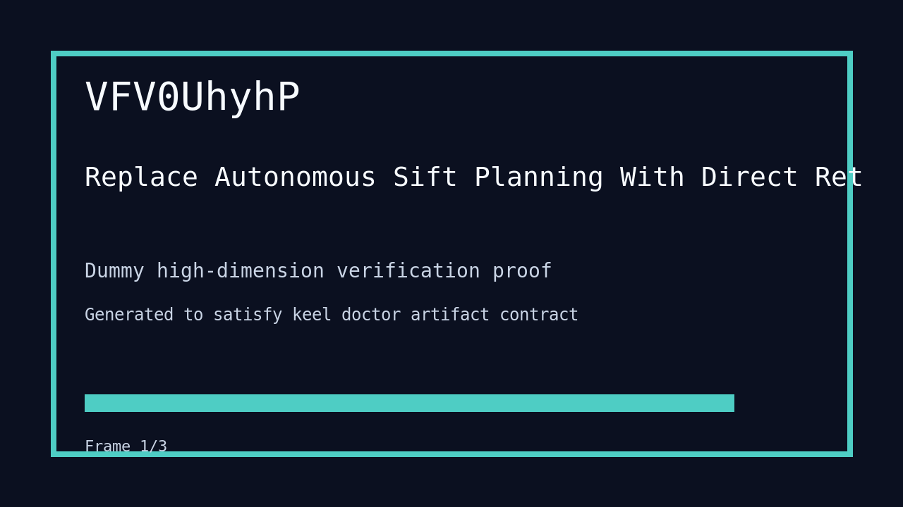

---
# system-managed
id: VFV0UhyhP
status: verified
created_at: 2026-03-31T18:38:00
updated_at: 2026-04-01T11:21:26
# authored
title: Replace Autonomous Sift Planning With Direct Retrieval
watch: ~
activated_at: 2026-03-31T18:42:58
achieved_at: 2026-03-31T19:08:21
verified_at: 2026-04-01T11:21:26
verification_artifact: verification.gif
---

# Replace Autonomous Sift Planning With Direct Retrieval

## Documents

| Document | Description |
|----------|-------------|
| [CHARTER.md](CHARTER.md) | Mission goals, constraints, and halting rules |
| [LOG.md](LOG.md) | Decision journal and session digest |
| [record-cli.gif](record-cli.gif) | CLI verification proof |
| [verification.gif](verification.gif) | High-dimension verification proof |

## Verification Proof

