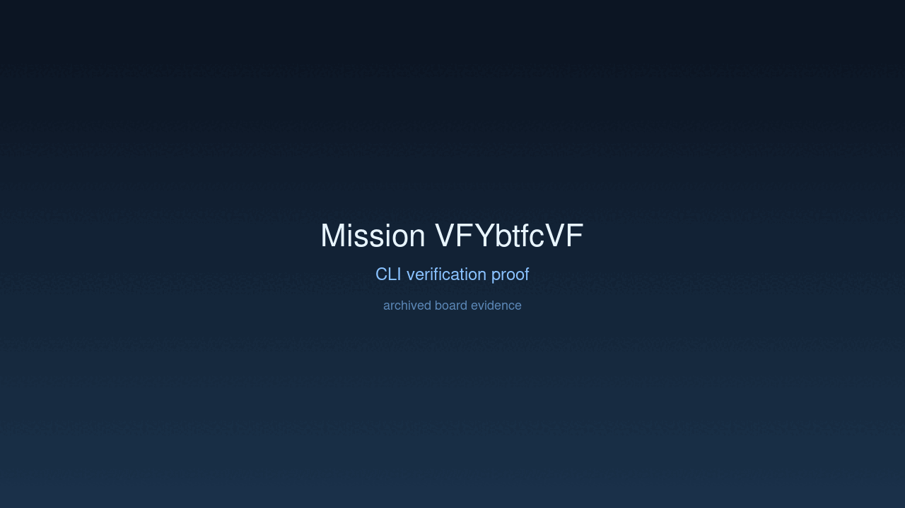
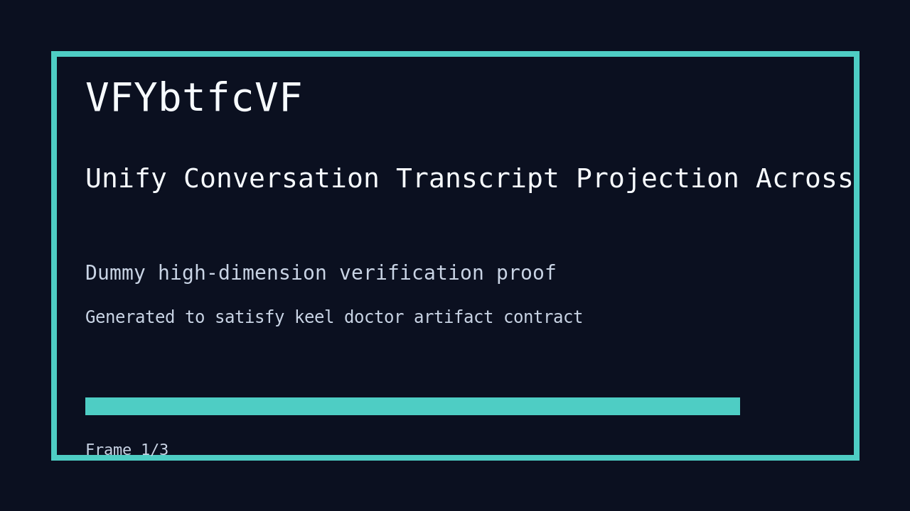

---
# system-managed
id: VFYbtfcVF
status: verified
created_at: 2026-04-01T09:25:23
updated_at: 2026-04-01T10:53:26
# authored
title: Unify Conversation Transcript Projection Across Interfaces
watch: ~
activated_at: 2026-04-01T09:28:11
achieved_at: 2026-04-01T10:53:26
verified_at: 2026-04-01T10:53:26
verification_artifact: verification.gif
---

# Unify Conversation Transcript Projection Across Interfaces

## Documents

| Document | Description |
|----------|-------------|
| [CHARTER.md](CHARTER.md) | Mission goals, constraints, and halting rules |
| [LOG.md](LOG.md) | Decision journal and session digest |
| [record-cli.gif](record-cli.gif) | CLI verification proof |
| [verification.gif](verification.gif) | High-dimension verification proof |

## Verification Proof

