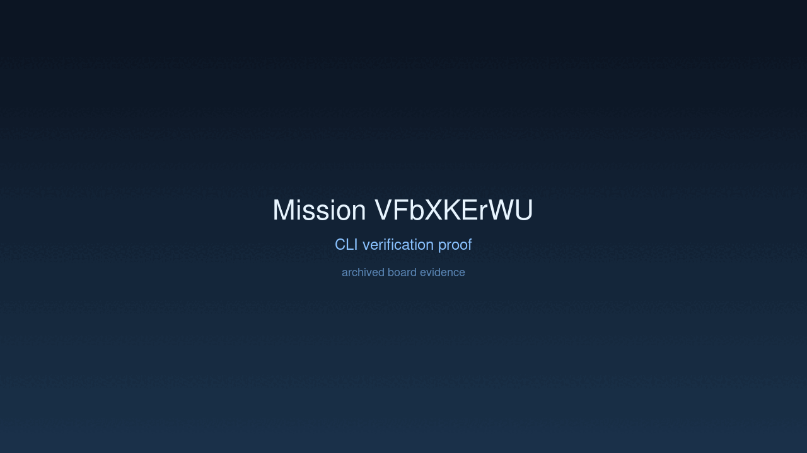

---
# system-managed
id: VFbXKErWU
status: verified
created_at: 2026-04-01T21:26:02
updated_at: 2026-04-01T22:45:02
# authored
title: Build Web Forensic Transit Inspector
watch: ~
activated_at: 2026-04-01T21:29:44
achieved_at: 2026-04-01T22:44:56
verified_at: 2026-04-01T22:45:02
---

# Build Web Forensic Transit Inspector

## Documents

| Document | Description |
|----------|-------------|
| [CHARTER.md](CHARTER.md) | Mission goals, constraints, and halting rules |
| [LOG.md](LOG.md) | Decision journal and session digest |
| [record-cli.gif](record-cli.gif) | High-dimension verification proof |

## Verification Proof

