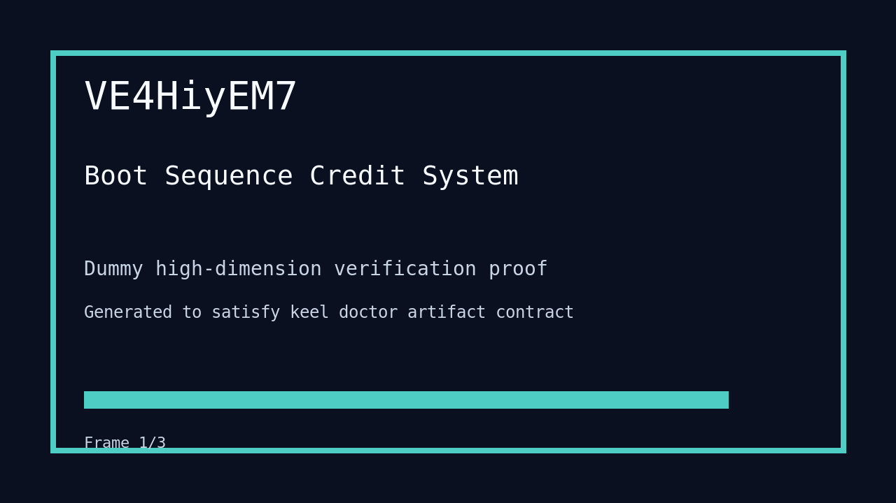

---
# system-managed
id: VFfudmTWs
status: verified
created_at: 2026-04-02T15:23:44
updated_at: 2026-04-02T16:05:00
# authored
title: Convert Web Surfaces To Turborepo React Workspace
watch: ~
activated_at: 2026-04-02T15:27:53
achieved_at: 2026-04-02T16:04:58
verified_at: 2026-04-02T16:05:00
verification_artifact: verification.gif
---

# Convert Web Surfaces To Turborepo React Workspace

## Documents

| Document | Description |
|----------|-------------|
| [CHARTER.md](CHARTER.md) | Mission goals, constraints, and halting rules |
| [LOG.md](LOG.md) | Decision journal and session digest |
| [verification.gif](verification.gif) | High-dimension verification proof |

## Verification Proof

