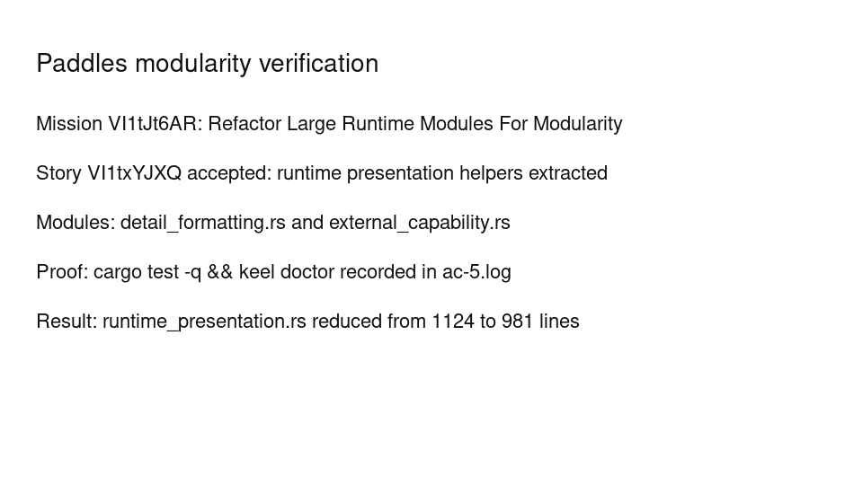

---
# system-managed
id: VI1tJt6AR
status: verified
created_at: 2026-04-27T14:34:14
updated_at: 2026-04-27T14:44:48
# authored
title: Refactor Large Runtime Modules For Modularity
watch: ~
activated_at: 2026-04-27T14:37:35
achieved_at: 2026-04-27T14:44:36
verified_at: 2026-04-27T14:44:48
verification_artifact: verification.gif
---

# Refactor Large Runtime Modules For Modularity

## Documents

| Document | Description |
|----------|-------------|
| [CHARTER.md](CHARTER.md) | Mission goals, constraints, and halting rules |
| [LOG.md](LOG.md) | Decision journal and session digest |
| [verification.gif](verification.gif) | High-dimension verification proof |

## Verification Proof

