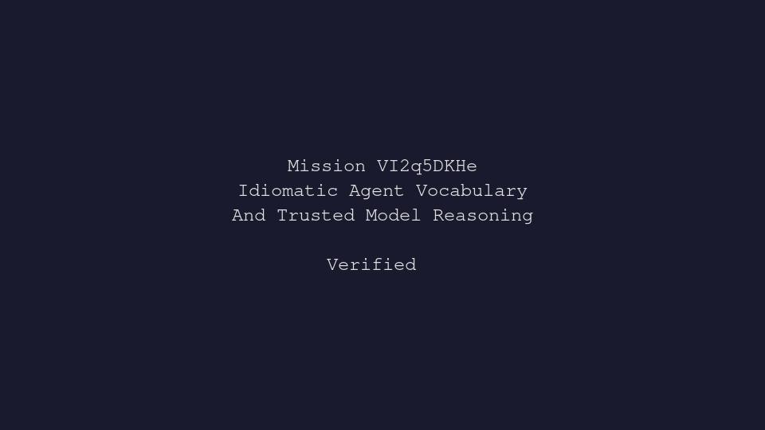

---
# system-managed
id: VI2q5DKHe
status: verified
created_at: 2026-04-27T18:27:39
updated_at: 2026-05-15T09:25:33
# authored
title: Idiomatic Agent Vocabulary And Trusted Model Reasoning
watch: ~
activated_at: 2026-04-27T18:46:16
achieved_at: 2026-04-27T22:45:08
verification_artifact: verification.gif
verified_at: 2026-05-15T09:25:33
---

# Idiomatic Agent Vocabulary And Trusted Model Reasoning

## Documents

| Document | Description |
|----------|-------------|
| [CHARTER.md](CHARTER.md) | Mission goals, constraints, and halting rules |
| [LOG.md](LOG.md) | Decision journal and session digest |
| [verification.gif](verification.gif) | High-dimension verification proof |

## Verification Proof

