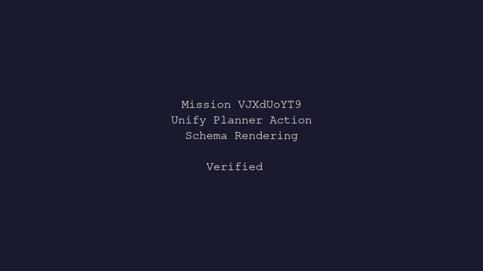

---
# system-managed
id: VJXdUoYT9
status: verified
created_at: 2026-05-13T15:20:59
updated_at: 2026-05-15T09:50:19
# authored
title: Unify Planner Action Schema Rendering
watch: ~
activated_at: 2026-05-13T15:29:56
achieved_at: 2026-05-13T16:05:24
verification_artifact: verification.gif
verified_at: 2026-05-15T09:50:19
---

# Unify Planner Action Schema Rendering

## Documents

| Document | Description |
|----------|-------------|
| [CHARTER.md](CHARTER.md) | Mission goals, constraints, and halting rules |
| [LOG.md](LOG.md) | Decision journal and session digest |
| [verification.gif](verification.gif) | High-dimension verification proof |

## Verification Proof

