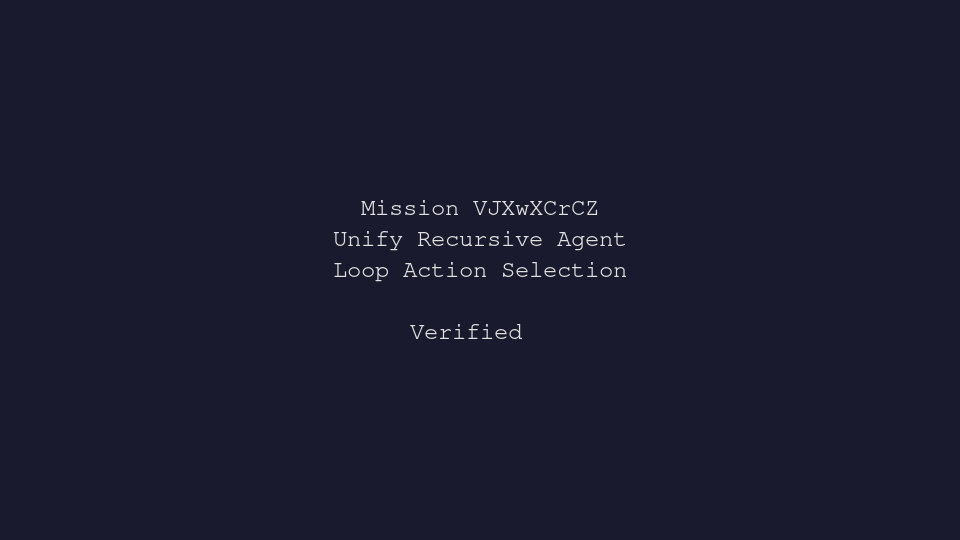

---
# system-managed
id: VJXwXCrCZ
status: verified
created_at: 2026-05-13T16:36:36
updated_at: 2026-05-15T09:52:03
# authored
title: Unify Recursive Agent Loop Action Selection
watch: ~
activated_at: 2026-05-13T16:40:12
achieved_at: 2026-05-13T17:28:01
verification_artifact: verification.gif
verified_at: 2026-05-15T09:52:03
---

# Unify Recursive Agent Loop Action Selection

## Documents

| Document | Description |
|----------|-------------|
| [CHARTER.md](CHARTER.md) | Mission goals, constraints, and halting rules |
| [LOG.md](LOG.md) | Decision journal and session digest |
| [verification.gif](verification.gif) | High-dimension verification proof |

## Verification Proof

