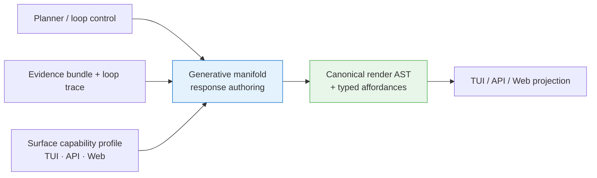
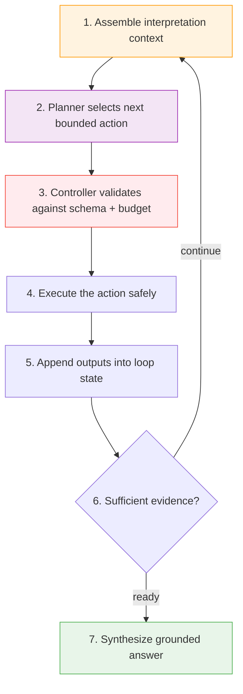
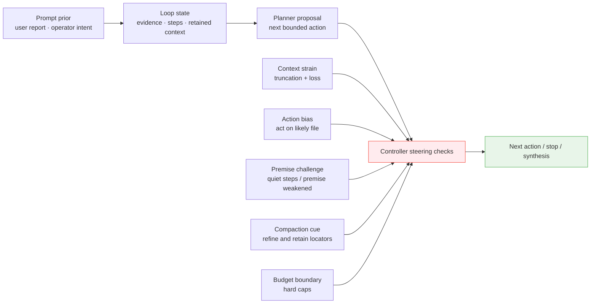

# Paddles Architecture: Recursive Harness Backbone

How `paddles` turns a user prompt into a grounded, evidence-backed answer through recursive in-context planning.

> Foundational stack position: `6/8`
> Read this after [POLICY.md](POLICY.md) and before [PROTOCOL.md](PROTOCOL.md).

## The Story of a Turn

Every turn through Paddles follows the same narrative arc: understand, investigate, and synthesize. The architecture exists to give small local models the structured support they need to produce answers that rival much larger models.

### Act 1: Interpretation

**`InterpretationContextAssembler`** builds the full picture before any decision is made.

The harness loads `AGENTS.md` operator memory from system, user, and ancestor scopes. A model-derived guidance subgraph discovers relevant procedures, tool hints, and project knowledge rooted at that memory. Recent turns, retained evidence, and prior tool state round out the context.

By the time the planner sees the prompt, it already knows the operator's priorities, the project's conventions, and the tools at its disposal.

### Act 2: Recursive Planning

**`PlannerLane`** drives an iterative investigation. The planner model evaluates the assembled context and selects its next bounded action: answer directly, search the workspace, read a file, inspect state, run a shell command, refine a query, branch into subqueries, or stop.

**`RecursiveExecutionLoop`** validates each action against schema and budget contracts, executes it safely, appends the output back into context, and loops. Each pass through the loop adds real evidence — file contents, search results, tool outputs — grounding the eventual answer in workspace reality.

The loop continues until the planner determines it has enough evidence, the budget is met, or an explicit stop is reached.

The important routing boundary is that the controller does not infer intent from prompt-token heuristics. The planner decides whether a turn should answer directly, inspect locally, recurse, or stop. The controller validates that choice and keeps the loop safe.

One fail-closed exception now exists for repository-scoped follow-ups. If the planner selects a direct answer for a turn that appears to refer to local architecture or ownership without grounded evidence, the controller bootstraps a local read-only probe before synthesis instead of permitting an ungrounded reply.

The missing control seam here used to be instruction satisfaction. The planner could correctly identify an edit turn, but nothing in the loop remembered that "make the edit" was an unsatisfied obligation, so a later prose recommendation could be mistaken for completion. Paddles now carries an explicit instruction frame for edit turns. That frame survives through recursive planning and answer handoff, and the controller will not accept advice-only completion while an `applied_edit` obligation is still open.

### The Engine, Its Chambers, And The Governor

At this point, "engine" is the right architectural word, not just a metaphor.

Paddles runs one turn-processing engine composed of typed chambers:

- **Interpretation**: assemble operator memory, guidance, and prior context
- **Routing**: commit to planner-directed turn flow
- **Planning**: choose and review bounded next actions
- **Gathering**: search or retrieve evidence
- **Tooling**: execute concrete workspace actions
- **Threading**: manage queued prompts, branches, and merge-back state
- **Rendering**: finalize the authored response for transcript projection
- **Governor**: supervise pace, stalls, and interventions across the whole engine

The important architectural change is that these are now first-class runtime states, not just labels inferred in the UI after the fact. The runtime emits typed `harness_state` events derived from ordinary turn events, carrying:

- the active chamber
- governor status
- a supervisory watch phase for long-running work
- optional intervention/detail text

That gives TUI, web, and future API clients one shared harness manifold instead of separate ad hoc interpretations of planner/gatherer/tool progress. UI projection should treat that watch phase as a pacing signal rather than proof that execution has terminated; a gathering row can legitimately report `watch=overtime` while the turn remains actively hunting and the projected total continues to move.

### Act 3: Synthesis

**`SynthesisLane`** takes the accumulated planner trace and evidence bundle and produces the final user-facing response. This is a separate model call optimized for answer quality, grounded in the concrete evidence the planner gathered. At boot, Paddles resolves a provider/model-specific render capability and then uses the strictest supported transport for final answers — native JSON schema or tool-call structure when available, prompt-enveloped JSON when not.

Planner and answer lanes now share one typed conversational handoff: recent turns plus the active thread summary. That keeps follow-up turns coherent even when the planner chooses a direct-answer route on one turn and a synthesizer-authored route on the next.

That handoff now also carries the active instruction frame. The answer lane therefore sees whether the turn still owes the user an applied repository edit, instead of seeing only evidence and conversational context.

Direct planner-authored answers no longer bypass this contract by leaking planner rationale into the transcript. Both synthesizer answers and planner-direct answers now normalize through the same canonical render AST (`heading`, `paragraph`, `bullet_list`, `code_block`, `citations`) before the UI projects them into transcript output. Planner rationale remains control-only metadata.

### Act 3.5: Generative Manifold

The render AST solved one half of the problem: every answer path now lands in one typed document model. The next architectural seam is a **generative manifold** that sits between planner control and rendering.

Its job is not to plan workspace actions and not to paint pixels. Its job is to author the best possible user-facing response for the active surface while staying accountable to the same evidence and render contract.

This layer matters because the available expression space changes by runtime context:

| Surface | Constraints | Extra capabilities |
|--------|-------------|--------------------|
| **TUI / plain CLI** | Compact width, low-friction scanability, plain-text fallbacks | Dense headings, compact bullets, terse citations, progress-oriented summaries |
| **API server** | Needs stable machine contracts, streaming safety, client portability | Typed blocks, explicit affordances, structured follow-up suggestions, route/navigation intents |
| **Web runtime** | Rich layout, persistent projection store, live trace/manifold routes | Linked citations, expandable cards, panel focus intents, trace-step highlighting, structured sidecars |

The generative manifold should therefore be surface-aware. It should consume a typed capability profile and choose among the authoring states that make sense for that surface:

- concise direct answer
- evidence-grounded explanation
- diagnostic walkthrough
- rich browser-ready response with navigation affordances
- structured API payload with explicit sidecars

The important boundary is what it must not do:

- It must not select workspace actions. That remains the planner loop.
- It must not silently change or reinterpret evidence. It authors from the gathered sources.
- It must not collapse into raw markdown. Its output stays typed.
- It must not live inside the renderer. Rendering projects the authored response; it does not invent it.

### Surface-Aware Output Contract

The canonical render AST is now the minimum common denominator across all answer paths, but a browser or API server can support more than plain transcript blocks. The generative manifold should therefore target a broader typed response envelope:

- `RenderDocument` for the human-readable answer body
- `citations` and trace/source locators
- `follow_up_suggestions`
- `navigation_affordances`
  examples: focus a transit step, reveal a manifold chamber, open a cited file
- `presentation_hints`
  examples: compact, diagnostic, compare, timeline

That gives Paddles one authoring seam that can stay modest in a terminal and much richer in a browser without reintroducing markdown guessing or planner/renderer conflation.

### Why It Is Not The Rendering Manifold

The steering-signal manifold is an expressive projection over controller state. It helps the operator understand what shaped the turn. The generative manifold is different: it authors the response itself.

Those are separate concerns:

- the **steering-signal manifold** visualizes how the harness was influenced
- the **generative manifold** authors what the harness says next
- the **renderer** projects that authored result into each surface

Keeping those roles separate prevents the system from hiding control metadata inside user-facing prose or expecting the renderer to recover structure that the authoring layer never produced.

### Narrative Machine Trace Surfaces

The transit and forensic web routes are now moving toward one simpler mental model: a turn should read like a Rube Goldberg machine, not like a storage browser. The default operator vocabulary for those routes is:

- `Input`: where the turn enters the machine
- `Planner`: where the next bounded move is chosen
- `Evidence probe`: where the machine inspects or gathers proof
- `Diverter`: where the path changes direction
- `Jam`: where progress catches and must recover
- `Spring return`: where the machine replans and snaps back into motion
- `Tool run`: where the machine acts on the workspace
- `Force`: where steering pressure pushes the machine
- `Output`: where the run lands in an answer, edit, commit, or explicit block

Those labels intentionally replace raw trace-storage language in the default UI path. Operators should not need to reason in terms of record kinds, graph nodes, or payload envelopes just to understand what happened in a turn.

Transit and forensic surfaces also share one interaction contract:

- selected turn id
- selected moment id
- optional internals mode

The internals path keeps raw record ids, trace ids, and payload content reachable, but it remains an explicit drill-down rather than the primary narrative surface. In the forensic inspector, the default route is a machine-first detail surface: atlas first, then a focused detail drawer that explains why the selected moment mattered, which steering forces shaped it, and what changed in artifact lineage before exposing raw payloads through the explicit `Show internals` control.

### Visibility Throughout

**`Renderer`** surfaces every step of this process — interpretation assembly, planner action selection, gatherer work, tool calls, context strain, fallback decisions, synthesis, and now typed harness/governor state — through a TUI transcript or plain CLI output. The renderer consumes normalized assistant blocks rather than relying on ad hoc markdown conventions from the model. The interactive TUI uses a compact inline viewport with a borderless live tail above the boxed composer, so completed transcript rows stay in normal terminal scrollback instead of disappearing behind a single full-screen page. When a turn step takes longer than two seconds with no new event, the TUI can now prefer the explicit harness chamber over guessed labels, so the operator sees real engine ownership rather than a best-effort inference.

**`RecorderBoundary`** captures the same runtime transitions as typed trace records with stable ids, flowing through a `TraceRecorder` port to noop, in-memory, or embedded `transit-core` adapters. The transcript UI is a projection of these records; durable lineage lives in the recorder.

**`ConversationThreadLayer`** maintains one durable conversation root across interactive sessions. Steering prompts become structured thread candidates, classified by a model into continuation, child-thread, or merge-back decisions — preserving full lineage for replay and analysis.

## Why This Shape Works

Three properties of this architecture compound to raise effective model performance:

1. **Interpretation arrives first.** Operator memory and project guidance shape the planner's priorities before it commits to any action. The model reasons within the operator's context from the start.
2. **Recursive evidence gathering earns the answer.** Instead of generating an answer from memory alone, the planner iteratively reads, searches, and refines until it has concrete evidence. Small models with tools consistently outperform the same models without them.
3. **Planning and synthesis are separate workloads.** The best recursive investigator may differ from the best answer composer. Separating these roles lets each be optimized independently and routed to the smallest capable model.

## Core Commitments

- **Interpretation before routing.** The model sees full context and chooses its own path.
- **Model-directed action selection.** The planner selects from a constrained action schema; the controller validates and executes.
- **`AGENTS.md` as the interpretation root.** Operator memory shapes investigation, priorities, and procedures — additional guidance flows through the model-derived graph.
- **Planner and synthesizer as distinct roles.** Each can use different models optimized for their workload.
- **Project artifacts as context.** Keel, board state, and domain knowledge enter through memory, search, and tools — keeping the harness general-purpose.
- **Bounded and observable recursion.** Every planner action is validated, budgeted, and visible to the operator.
- **Local-first by default.** The core loop runs on local models; heavier lanes are opt-in and degrade gracefully.

## The Planner Loop In Detail

The planner loop is the heart of the backbone. Each cycle follows a clear rhythm:

The planner operates within bounded action and budget contracts. Every action is validated before execution, every output is recorded, and the operator can observe the full trace.

## Steering Signals

Pressure in Paddles is a controller layer, not a loose metaphor. The runtime uses it to decide when the loop should keep investigating, when it should compress context, and when the evidence already justifies stopping.

### Pressure Families

| System | Trigger | What it does | Trace surface |
|-------|---------|--------------|---------------|
| **Context strain** | Truncated memory, artifacts, thread summaries, or evidence-budget loss | Warns that the assembled context is degraded | `TurnEvent::ContextStrain`, `TraceSignalKind::ContextStrain` |
| **Action bias** | Mutation/known-edit turns with no file-targeting action yet | Adds a planner review note that biases broad non-file work toward a plausible file read/edit | `Fallback(stage = action-bias)`, `TraceSignalKind::ActionBias` |
| **Premise challenge** | Enough evidence but too many quiet steps, or evidence weakens the prompt's premise | Adds a planner review note or refinement trigger so the planner must judge the sources explicitly | `RefinementApplied`, `PlannerSummary(stop_reason = premise-challenge...)`, `TraceSignalKind::BudgetBoundary` |
| **Compaction cue** | Active context is getting too noisy for useful next actions | Summarizes/prunes low-value artifacts while preserving locators; today this remains mostly heuristic | `TraceSignalKind::CompactionCue` |
| **Budget boundary** | Step, search, inspect, or read caps are reached | Terminates recursion honestly | `PlannerSummary(stop_reason = *-budget-exhausted)`, `TraceSignalKind::BudgetBoundary` |

### Context Strain

`StrainTracker` accumulates truncation events during context assembly and emits a `ContextStrain` turn event when the result is non-nominal. The factors are explicit:

- `memory-truncated`
- `artifact-truncated`
- `thread-summary-trimmed`
- `evidence-budget-exhausted`

This steering signal is observational. It tells the operator and the trace that the current answer may be operating with a degraded working set.

### Action Bias

Action bias exists to encode the principle that action produces information. On edit-oriented turns, repeated search, inspect, or refine actions are often lower value than reading the most plausible target file. When the controller has enough path evidence, it re-enters the planner with an action-bias review note so the model can judge whether to read, diff, or edit that likely file now.

That path evidence is now grounded by a deterministic entity resolver before broad search or mutation continues. The resolver self-discovers authored workspace files from the repository tree and `.gitignore` boundary, then returns one of three explicit outcomes:

- **Resolved** — one authored target won the ranking and can be promoted into read/diff/edit actions.
- **Ambiguous** — multiple authored targets remain tied, so the controller keeps the turn in evidence-gathering mode and surfaces the candidates.
- **Missing** — no safe authored target matched the hint, so the controller fails closed and replans instead of hallucinating a path.

This resolver is intentionally narrower than full semantic code intelligence. Its job is deterministic authored-path convergence for edit-oriented turns, not IDE-fed state, background LSP indexing, or speculative symbol reasoning.

Known-edit turns also reserve a modest amount of extra read, inspect, and search headroom before the workspace-editor boundary fires, so the planner can inspect a few candidate files without exhausting the turn before any patch is applied.

If that first contained budget still runs out before an edit lands, the controller now performs one bounded replan. The replan preserves accumulated evidence, injects an explicit "do not restart" note into loop state, updates the shared checklist, and expands the known-edit step/read/inspect/search envelope for one more pass.

This is why a mutation turn should not spend its whole budget doing broad retrieval after the likely file is already on the board.

Git-commit turns now ride the same convergence rails. When a prompt explicitly
asks Paddles to make a commit, the controller opens a commit obligation,
bootstraps `git status --short` if the planner tries to answer directly, and
keeps the turn inside the planner loop until a `git commit` action succeeds.
Once both `git status` and `git diff` are already on the board, action-bias
review treats another advice-only stop as non-convergent and steers the model
toward recording the commit instead.

### Premise Challenge

Premise challenge is the system that keeps the harness intellectually honest.

It has two important modes:

1. **Quiet-step refinement**
   After evidence has accumulated but several steps fail to add anything new, the controller derives a refined interpretation context. This is how the loop resists thrashing.
2. **Premise judgement**
   A user can supply the initial hypothesis, but gathered sources must be allowed to overturn it. When the turn has enough source material to question the premise, the controller re-enters the planner with an explicit premise-challenge review note. The planner then chooses whether to stop, revise the premise, or continue with one more specific action.

This is the steering-signal family that prevents the planner from repeatedly shrinking `gh run list --limit N` instead of admitting that the current evidence does not confirm the original claim. The important detail is that the stop or revision now comes from a planner review pass over the evidence, not from a CI-specific controller hard stop.

### Compaction Cue

Compaction is how the harness stays sharp under depth. The interface is designed for planner-driven compaction, but the current adapters still implement compaction with bounded heuristics. Pruned material is not lost; typed locators preserve reachability into transit and filesystem tiers.

### Budget Boundary

Budget boundary is the hard outer wall around recursion. Even if the planner keeps wanting more steps, the controller stops after bounded step, search, inspect, or read limits. Those stop reasons are part of the recorded influence model, not silent control flow.

### Steering Signals And Influence Snapshots

The trace model records influence snapshots so the operator can inspect not just what happened, but what shaped the turn:

- `context_strain`
- `action_bias`
- `compaction_cue`
- `budget_boundary`
- `fallback`

Each snapshot carries a magnitude, a summary, and source-attributed contribution estimates. The web forensic inspector uses these as first-class visualization inputs.

### Forensic Inspector And Manifold Route

The web UI now carries two distinct trace projections over the same recorder-backed source of truth:

- the **forensic inspector**, which now defaults to a machine-first detail drawer before revealing raw payload internals
- the **steering-gate manifold**, which stays expressive and systemic

The manifold route is intentionally metaphorical. It now simplifies the steering layer into three first-class gates:

- **Evidence** — whether the turn has enough grounded local evidence to justify narrowing
- **Convergence** — whether the planner is being pulled toward an exact next action or edit
- **Containment** — whether the controller is compressing, recovering, or enforcing a boundary

Raw signal kinds still exist in the recorder, but the manifold no longer asks the UI to infer structure from them. Instead, each snapshot resolves onto one of those gate families and a gate phase, and the web route projects them onto three axes:

- time across replay frames
- gate family across the lane stack
- magnitude as depth toward the viewer

That makes the route easier to scan without weakening accountability to the recorder.

That metaphor is only valid if it remains accountable to exact trace sources. Selecting a manifold state must reveal the exact underlying source record and provide a direct route back to the forensic inspector for raw/rendered payload inspection. The manifold is therefore an expressive overview, not a second source of truth.

Resolver-backed states are part of that accountability contract. When a selected signal came from deterministic entity resolution, the manifold readout shows the resolver status (`resolved`, `ambiguous`, or `missing`), the chosen authored path or candidate set, and the explanation recorded by the controller. The operator can still route back to the exact source snapshot in the forensic inspector for raw payload inspection.

This route also remains inside the local-first delivery contract. Frontend ownership is now split between `apps/docs` and the `apps/web` TanStack React runtime inside one Turborepo workspace. The Rust server serves that built runtime directly on the primary routes `/`, `/transit`, and `/manifold`. There is no iframe proxy layer and no secondary `/app` or `/legacy` route family, so the live session path, the browser E2E path, and the shipped frontend artifact stay under one owner.

The runtime web UI now hydrates from one canonical conversation projection:

- the browser bootstraps through `GET /session/shared/bootstrap`
- the React runtime stores one shared `ConversationProjectionSnapshot`
- chat, transit, and manifold all read from that store instead of panel-local replay fetches
- one session-scoped stream at `GET /sessions/{id}/projection/events` carries both projection rebuilds and turn-progress events

That simplification matters because it makes replay recovery, live sync, and browser E2E all follow the same path. When a turn is injected from outside the page — for example from the TUI or a test harness — the web UI updates by consuming the same shared projection contract it would use after a reload.

## Embedded Fallback Shell Parity Boundary

When `apps/web/dist` is unavailable, the Rust server falls back to the
compiled-in `src/infrastructure/web/index.html` shell. That artifact is a
delivery boundary, not a second frontend architecture.

The embedded shell must stay aligned on the operator-facing runtime contract:

- primary routes `/`, `/transit`, and `/manifold`
- the shared chat transcript and prompt composer
- live turn/event streaming, including tool output and plan updates
- the forensic inspector shell
- the transit trace shell
- the manifold route shell and transcript-driven manifold turn selection
- sticky-tail chat scrolling so off-tail operators keep their place during live updates

The embedded shell does not need React component/module parity with the
decomposed `apps/web` runtime. It may remain a single-file DOM/JS delivery
surface as long as those operator-facing behaviors remain aligned and the
bounded differences stay explicit in tests and docs.

## Planner Action Vocabulary

The planner expresses its intentions through a constrained action schema:

| Action | Purpose |
|--------|---------|
| **answer** | Synthesize now — evidence is sufficient |
| **search** | Find relevant files or content in the workspace |
| **list_files** | Discover candidate files by pattern |
| **read** | Read a specific file or artifact |
| **inspect** | Examine read-only workspace state |
| **shell** / **diff** / **edit** | Execute concrete workspace modifications |
| **refine** | Sharpen a search query based on prior results |
| **branch** | Split an investigation into parallel subqueries |
| **stop** | Request synthesis with current evidence |

These actions are backed by Sift search, workspace tools, retained artifacts, and specialist planner-capable providers like `context-1`.

## The Value of Planner/Synthesizer Separation

Separating these roles unlocks three benefits:

- **Independent optimization** — the best recursive investigator and the best answer composer are often different models, and each can be routed to its ideal lane
- **Cleaner evidence flow** — planner traces are working artifacts that inform synthesis; the synthesizer transforms them into polished, grounded responses
- **Flexible routing** — operators can mix a lightweight synthesizer with a heavier planner, or vice versa, matching each role to available hardware

## Project Context as Evidence

Keel, board state, mission files, PRDs, and domain knowledge all enter the planner through the same channels as any other evidence:

- operator memory (AGENTS.md hierarchy)
- workspace search results
- file reads and tool outputs
- retained evidence from prior recursive steps

This keeps `paddles` general-purpose — useful with any project tooling, board engine, or domain.

## Implementation Map

The target architecture is implemented across these modules:

| Layer | Module | Role |
|-------|--------|------|
| **Runtime** | [src/application/mod.rs](/home/alex/workspace/spoke-sh/paddles/src/application/mod.rs) | Controller-owned service, session-scoped thread orchestration |
| **Turn Events** | [src/domain/model/turns.rs](/home/alex/workspace/spoke-sh/paddles/src/domain/model/turns.rs) | Typed turn and planner event definitions |
| **Planner Contract** | [src/domain/ports/planning.rs](/home/alex/workspace/spoke-sh/paddles/src/domain/ports/planning.rs) | Bounded action schema and planner port |
| **Planner Adapter** | [src/infrastructure/adapters/sift_planner.rs](/home/alex/workspace/spoke-sh/paddles/src/infrastructure/adapters/sift_planner.rs) | Sift-backed planner model |
| **Synthesizer Adapter** | [src/infrastructure/adapters/sift_agent.rs](/home/alex/workspace/spoke-sh/paddles/src/infrastructure/adapters/sift_agent.rs) | Sift-backed synthesis + guidance graph derivation |
| **Gatherer** | [src/infrastructure/adapters/sift_direct_gatherer.rs](/home/alex/workspace/spoke-sh/paddles/src/infrastructure/adapters/sift_direct_gatherer.rs) | Direct sift-backed retrieval backend |
| **Operator Memory** | [src/infrastructure/adapters/agent_memory.rs](/home/alex/workspace/spoke-sh/paddles/src/infrastructure/adapters/agent_memory.rs) | AGENTS.md hierarchy + tool hint extraction + procedure derivation |
| **Trace Contract** | [src/domain/model/traces.rs](/home/alex/workspace/spoke-sh/paddles/src/domain/model/traces.rs) | Stable task/turn/record/branch/checkpoint ids |
| **Recorder Port** | [src/domain/ports/trace_recording.rs](/home/alex/workspace/spoke-sh/paddles/src/domain/ports/trace_recording.rs) | TraceRecorder boundary |
| **Recorder Adapters** | [src/infrastructure/adapters/trace_recorders.rs](/home/alex/workspace/spoke-sh/paddles/src/infrastructure/adapters/trace_recorders.rs) | Noop, in-memory, embedded transit-core |
| **Native Transport Substrate** | [src/domain/model/native_transport.rs](/home/alex/workspace/spoke-sh/paddles/src/domain/model/native_transport.rs) | Shared lifecycle, auth, capability, and diagnostics vocabulary for HTTP, SSE, WebSocket, and Transit |
| **Native Transport Registry** | [src/infrastructure/native_transport.rs](/home/alex/workspace/spoke-sh/paddles/src/infrastructure/native_transport.rs) | `NativeTransportRegistry` — shared transport diagnostics state and lifecycle recording |
| **Thread Replay** | [src/domain/model/threading.rs](/home/alex/workspace/spoke-sh/paddles/src/domain/model/threading.rs) | Replay/projection layer for conversation traces |
| **Context Quality** | [src/domain/model/context_quality.rs](/home/alex/workspace/spoke-sh/paddles/src/domain/model/context_quality.rs) | `ContextStrain`, `StrainTracker`, `StrainLevel` types |
| **Context Resolution** | [src/domain/ports/context_resolution.rs](/home/alex/workspace/spoke-sh/paddles/src/domain/ports/context_resolution.rs) | ContextResolver port for cross-tier locator resolution |
| **Transit Resolver** | [src/infrastructure/adapters/transit_resolver.rs](/home/alex/workspace/spoke-sh/paddles/src/infrastructure/adapters/transit_resolver.rs) | TransitContextResolver — inline, transit, filesystem dispatch |
| **Conversation Crate** | [crates/paddles-conversation/src/lib.rs](/home/alex/workspace/spoke-sh/paddles/crates/paddles-conversation/src/lib.rs) | ContextTier, ContextLocator, ArtifactEnvelope, conversation primitives |
| **Transcript TUI** | [src/infrastructure/cli/interactive_tui.rs](/home/alex/workspace/spoke-sh/paddles/src/infrastructure/cli/interactive_tui.rs) | Codex-style action stream with shared `0/1/2/3` verbosity tiers and in-flight silence indicators |

### How The Pieces Fit Together

The runtime follows the backbone narrative from above:

1. **Interpretation** — operator memory loads from the AGENTS.md hierarchy, then a model-derived guidance graph discovers tool hints and decision procedures. Invalid initial replies get one constrained re-decision pass before the controller fails closed.
2. **Planning** — workspace actions stay inside the planner loop. Search/refine actions carry model-selected retrieval mode, strategy, and optional structural fuzzy retriever overrides into the gatherer boundary. The `sift-direct` gatherer executes direct retrieval, preserving evidence metadata and surfacing concrete retrieval stages without introducing a second planner.
3. **Recording** — the recorder boundary is live. Artifact envelopes keep large payloads behind typed `ContextLocator` values with tier metadata. Truncated inline content resolves to full records on demand through the `ContextResolver` port.
4. **Context quality** — a `StrainTracker` accumulates truncation events during context assembly and emits `ContextStrain` as a turn event when strain is non-nominal.
5. **Threading** — session-scoped orchestration uses the shared conversation crate for structured candidates, model-driven decisions, and explicit merge-back records.

### Growing Edges

- **Sift-tier locator resolution** — typed `ContextLocator::Sift` values are emitted from retrieval today; direct Sift resolver wiring is still being finalized
- **Automatic tier promotion/demotion** — content moves between tiers manually; automatic promotion policies are future work
- **Default recorder policy** — embedded transit-core is available; the default runtime uses noop until the policy slice lands
- **Context-1 integration** — available as an explicit experimental boundary for opt-in use

## Shared Native Transport Substrate

The shared native transport substrate sits beside the recorder boundary as the operator-facing contract for local connection modes. Its job is to keep HTTP request/response, SSE, WebSocket, and Transit adapters from inventing separate readiness vocabularies.

The domain model in `NativeTransportKind`, `NativeTransportCapability`, `NativeTransportPhase`, `NativeTransportAuthMode`, and `NativeTransportDiagnostic` defines the common authored and observed state. The infrastructure `NativeTransportRegistry` owns the live diagnostic snapshot for each transport and is the single place where runtime code should record:

- whether a transport is enabled
- which phase it is in
- which bind target it is using
- which auth mode it negotiated
- which active session identity it has negotiated
- which error most recently pushed it into failure

HTTP request/response, SSE, WebSocket, and Transit now bind through the same primary web listener. WebSocket adds session-oriented behavior on top of that shared listener, while Transit adds structured request/response semantics on top of the same shared listener. Both adapters still record readiness, negotiated session or channel identity, degradation, and failure through `NativeTransportRegistry` rather than inventing parallel transport-specific health surfaces.

This keeps the shared native transport substrate stable while protocol-specific stories add bind loops, session semantics, or stream behavior.

## Recorder Boundary

The recorder path delivers storage-neutral trace durability:

1. Runtime transitions produce typed `TraceRecord` values
2. Transcript rendering flows through `TurnEventSink` as operator-facing projection
3. Durable recording and session wake/slice queries flow through `TraceRecorder` as the source of truth
4. Noop and in-memory adapters preserve local safety and enable testing
5. Embedded `transit-core` maps roots, branch heads, appends, replay, checkpoints, and checkpoint-backed resume slices — all through the domain boundary, keeping transit types internal
6. Interactive thread split/merge records flow through the same recorder path, making thread structure part of the durable trace

This design keeps the domain storage-neutral while providing lineage durable enough for replay, branch comparison, and graph-trace analysis.

The durable session contract now names four higher-level operations that later harness layers can depend on without caring which recorder adapter is underneath:

- `wake(task_id)` discovers the latest record position and known checkpoint cursors for a prior task
- `replay(task_id)` reconstructs the full ordered lineage
- `resume_from_checkpoint(task_id, checkpoint_id)` resumes from a named checkpoint via a forward replay slice
- `replay_slice(task_id, request)` interrogates a deterministic forward or backward slice anchored at a task root, turn, branch, record, checkpoint, or tail

## Context Architecture

Context in Paddles spans four tiers with increasing depth and decreasing immediacy. Each tier has explicit boundaries, typed addressing, and lazy cross-tier resolution.

### Four-Tier Context Model

| Tier | Boundary | What lives here | Access |
|------|----------|----------------|--------|
| **Inline** | Character-limited content in working memory | Truncated artifact excerpts in `ArtifactEnvelope.inline_content` | Direct read |
| **Transit** | Full records in durable streams | Complete trace records keyed by task and record id | Replay via `TransitContextResolver` |
| **Sift** | Indexed evidence in retrieval indexes | Ranked retrieval results from autonomous search |
| **Filesystem** | Workspace files on disk | Source files, configs, project artifacts | `tokio::fs::read_to_string` |

### Transit-Native Context Addressing

Every `ArtifactEnvelope` carries an optional typed `ContextLocator` that encodes which tier holds the full content and how to reach it. When inline content is truncated, the locator points to the full record in transit or on disk. Consumers call `resolver.resolve(&locator)` to retrieve full content on demand — resolution is lazy, pull-based, and never eagerly loads deeper tiers.

Resolution follows a local-first ordering: inline content returns immediately, transit replays local streams, filesystem reads local disk. When a tier is unavailable or a record is missing, resolution fails closed with an explicit error naming the tier and locator details.

### Compaction Planning Today

The compaction interface is shaped for recursive self-assessment, but the current planner adapters do not yet fully earn that label. Today a `CompactionEngine` walks retained evidence and applies bounded keep/compact/discard heuristics while preserving addressable locators to the pruned content. This keeps the working context tight without losing depth, but it is still more policy-driven than planner-judged.

### Context Strain Signals

Context budget exhaustion is modeled as a first-class capability signal through `ContextStrain`. A `StrainTracker` accumulates truncation events during context assembly — memory documents exceeding the 12k character cap, truncated artifact envelopes, trimmed thread summaries. The tracker computes a `StrainLevel` (Low / Medium / High / Critical) from the count of truncation events and emits a `TurnEvent::ContextStrain` when strain is non-nominal.

These signals are informational at the context-quality layer — they surface context degradation in the turn event stream and into influence snapshots. Higher-order controller pressures, such as action bias and premise challenge, are what actually redirect or stop the recursive loop.

### In-Flight Visibility

When a turn step takes longer than 2 seconds with no new event in the transcript, the TUI inserts a contextual in-flight row in a muted style — "Planning...", "Synthesizing...", "Searching...", etc. — derived from the last completed event. This prevents the transcript from appearing stalled during long model calls. The row stays in history as a marker of the gap.

## Current Backbone Status

The backbone contract is delivered for the primary interactive and `process_prompt` runtime:

1. Interpretation context assembles before routing
2. The model selects its first bounded action
3. The controller validates and executes it
4. The loop recurses until synthesis is appropriate

Two capabilities are still maturing:

- **Resource graph breadth** — planner search/refine delegates through the configured gatherer backend today; a unified resource graph will broaden what the planner can reach
- **Concurrent threading** — auto-threading replays and merges explicit thread lineage at safe checkpoints; true simultaneous sibling generation on one local model session is a future capability

## Current Model Routing

Current routing now uses explicit planner/synth roles:

- synthesizer default: `qwen-1.5b`
- planner default: synthesizer model unless `--planner-model` overrides it
- optional coding-oriented planner/synth models: `qwen-coder-0.5b`,
  `qwen-coder-1.5b`, `qwen-coder-3b`
- heavier opt-in planner/synth lane: `qwen3.5-2b`
- local gatherer backend: `sift-direct`
- current gatherer mode: planner-selected bounded retrieval for `search` / `refine` requests
- experimental planner/gatherer boundary: `context-1`

## Context-1 Fit

`context-1` belongs on the planner side of the architecture — a candidate specialized planner/gatherer lane. The recursive loop is fundamentally about iterative retrieval, pruning, and refinement, which aligns with context-1's strengths. Final answers continue to come from the separate synthesizer contract.

## Documentation Contract

The foundational documents work together to tell the full story:

- **README** — backbone architecture narrative and current capabilities
- **ARCHITECTURE** — detailed turn loop, implementation map, and growing edges
- **POLICY** — operational commitments that govern the runtime
- **AGENTS** — operator guidance aligned with those commitments

The recursive planner loop tracks toward full delivery under mission `VFDv1ha1G`.
