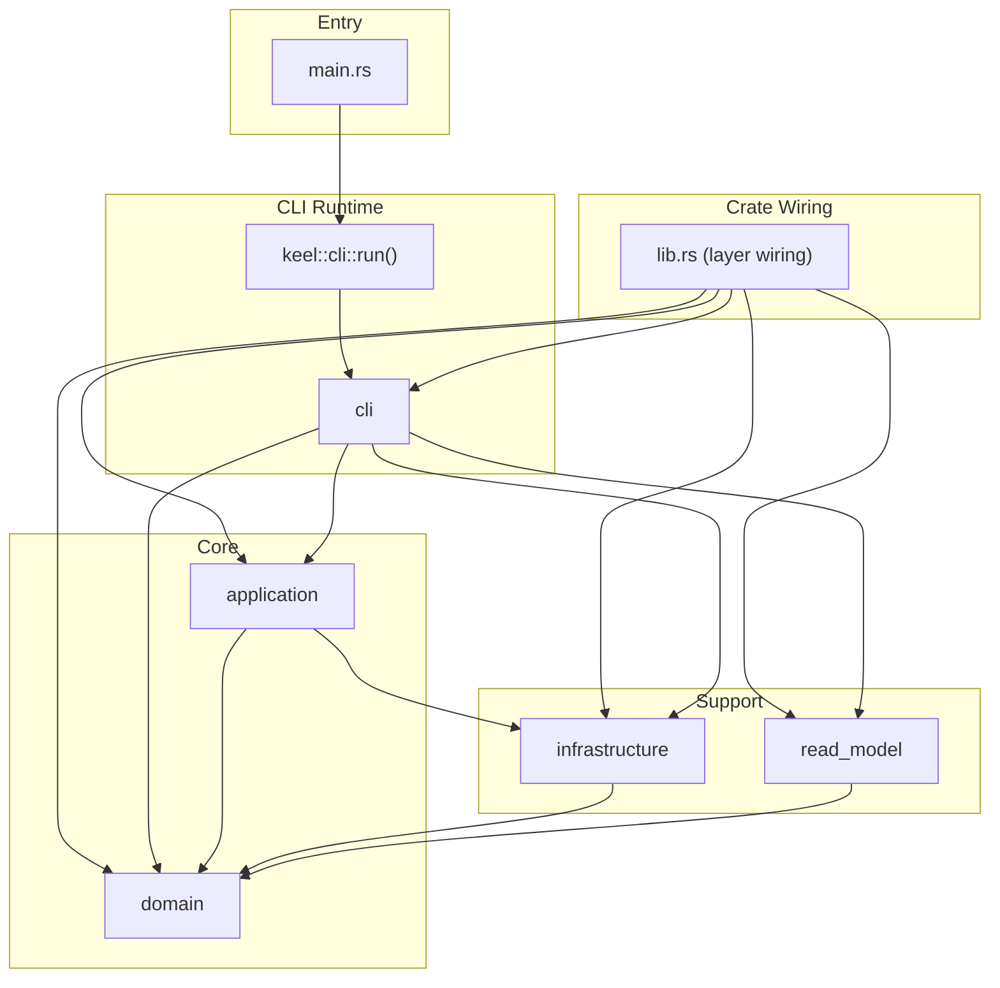
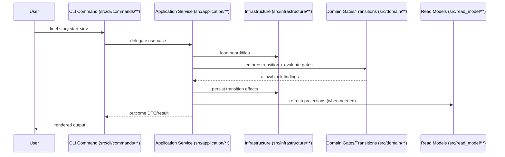
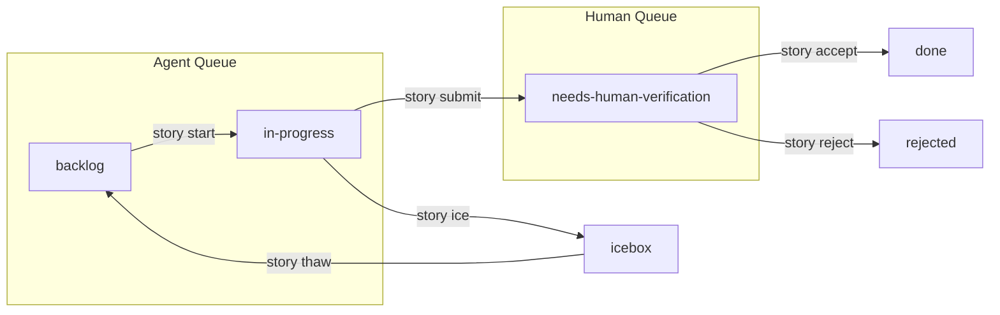

# Keel Architecture

This document describes the current architecture of `keel`: the normalized DDD layer layout, the 2-queue pull model, entity state machines, and transition gating.

## Scope

This document is the implementation contract for source layout, dependency boundaries, runtime flows, and state-machine behavior. Governance philosophy and document hierarchy are defined upstream in `README.md` and `AGENTS.md`.

## Layered Source Layout

Keel now uses five explicit source roots under `src/`:

| Root | Responsibility | Key Modules |
|------|----------------|-------------|
| `src/cli` | CLI adapters, command handlers, terminal formatting, queue display | `commands/**`, `presentation/flow/**`, `style.rs`, `table.rs` |
| `src/application` | Use-case orchestration and process manager behavior | `story_lifecycle.rs`, `voyage_epic_lifecycle.rs`, `process_manager.rs` |
| `src/domain` | Core entities, policies, state machines, transition rules | `model/**`, `policy/**`, `state_machine/**`, `transitions/**` |
| `src/infrastructure` | Filesystem adapters, parsers, templates, verification runners, generation | `loader.rs`, `parser.rs`, `templates.rs`, `validation/**`, `verification/**`, `generate/**`, `config.rs` |
| `src/read_model` | Query-side projections and derived views for flow, capacity, evidence, knowledge | `flow_status.rs`, `capacity.rs`, `queue_policy.rs`, `traceability.rs`, `evidence.rs`, `knowledge/**` |

Entry and test roots:
- `src/lib.rs` wires the five layer roots (`cli`, `application`, `domain`, `infrastructure`, `read_model`).
- `src/main.rs` is a thin binary bootstrap that delegates to `keel::cli::run()`.
- `src/*_tests.rs` files at root are test-only modules.

## Architecture Diagrams

### 1) Layer Dependency Map



### 2) Command Execution Path (Typical Story Command)



### 3) Queue and Story Lifecycle View



## Bounded Context Ownership Map

This map describes logical ownership by business context while using the normalized physical layers.

| Context | Responsibility | Primary Modules |
|---------|----------------|-----------------|
| `governance` | ADR lifecycle, role taxonomy, constitutional constraints | `src/cli/commands/management/adr/**`, `src/domain/model/taxonomy.rs`, `src/domain/state_machine/invariants.rs` |
| `work-management` | Story/voyage/epic lifecycle orchestration and transitions | `src/cli/commands/management/story/**`, `src/cli/commands/management/voyage/**`, `src/cli/commands/management/epic/**`, `src/application/**`, `src/domain/state_machine/**`, `src/domain/transitions/**` |
| `research` | Bearing discovery, play workflow, and synthesis inputs | `src/cli/commands/management/bearing/**`, `src/cli/commands/management/play.rs`, `src/read_model/knowledge/**` |
| `verification` | Verified Spec Driven Development (VSDD): Evidence capture, structural checks, command proof execution | `src/cli/commands/management/verify.rs`, `src/cli/commands/diagnostics/doctor/**`, `src/infrastructure/verification/**`, `src/infrastructure/validation/**`, `src/read_model/evidence.rs`, `src/read_model/traceability.rs` |
| `read-model` | Flow/capacity projections and queue-policy facades | `src/read_model/**`, consumed by `src/cli/presentation/flow/**` and `src/cli/commands/management/next_support/**` |

Boundary rules:
- Each production source file belongs to exactly one layer root.
- CLI modules are adapters: parse input, delegate, render output.
- Read-model modules are query-side projection code, not transition actuators.
- Domain rules are centralized in domain policies/state machines/transitions and reused by command and reporting paths.

## Enforced Architecture Contracts

`src/architecture_contract_tests.rs` enforces key boundaries:

- `main.rs` must remain a minimal bootstrap adapter that delegates to `keel::cli::run()`.
- `main.rs` must not depend on `domain`, `application`, `infrastructure`, or `read_model` directly.
- `lib.rs` must declare only the normalized layer roots: `cli`, `application`, `domain`, `infrastructure`, and `read_model`.
- Legacy top-level module families (for example old `src/commands`, `src/model`, `src/loader.rs`) must not exist.
- Diagnostic adapters must not bypass into unrelated lifecycle command modules.
- Read-model projection files must not import CLI command handlers or domain transition execution.
- Queue policy consumers must use the shared read-model API.

These tests are the executable architecture specification.

## Workflow Lane Pull System

Keel coordinates work through configurable workflow lanes with a pull model. The topology is fully defined and overridable in `keel.toml` using `[workflow.defaults]`, `[roles]`, and `[lanes]` sections.

The zero-config topology seeds:

| Lane | Selected Sources | Default Role | Purpose |
|------|------------------|--------------|---------|
| `management` | `bearing.*`, `voyage.draft`, `story.needs-human-verification` | `manager` | Planning, triage, calibration, acceptance |
| `delivery` | `story.backlog`, `story.in-progress` | `operator` | Active delivery work |

Pull commands:
- `keel next --role manager`: management lane only (never returns implementation `Work`).
- `keel next --role <role>`: pull work from the lane associated with the role family.
- `keel next --role operator`: delivery lane (`in-progress` then `backlog`).
- `keel next` requires `--role`; there is no implicit management-lane fallback.
- `keel flow`: visual dashboard using the same queue policy semantics plus topology-resolved lane cards.

Config-driven mapping:
- Every role (e.g., `operator/software`) resolves to a **Role Family** (e.g., `operator`).
- Each Role Family has a configured `default_lane` in `keel.toml`.
- Lanes filter entities by status and source (e.g., `story.backlog`).
- `keel flow` renders lanes in priority order.

Canonical queue policy location:
- Core thresholds and categories: `src/domain/policy/queue.rs`.
- Shared read facade: `src/read_model/queue_policy.rs`.

| Constant | Value | Behavior |
|----------|-------|----------|
| `HUMAN_NEXT_VERIFY_BLOCK_THRESHOLD` | 5 | Human `keel next` blocks new work when verification queue is `>= 5`. |
| `FLOW_VERIFY_BLOCK_THRESHOLD` | 20 | Flow enters `VERIFY_BLOCKED` when verification queue is `> 20`. |

Verification queue categories are shared across command and flow paths:
- `Empty` when queue is `0`.
- `Attention` when queue is `1..4`.
- `HumanBlocked` when queue is `5..20` (blocks human `keel next`).
- `FlowBlocked` when queue is `> 20` (blocks flow and human `keel next`).

Management-lane `keel next --role <management-role>` decision set is constrained to:
`decision`, `accept`, `research`, `needs-stories`, `needs-planning`, `blocked`, `empty`.
It never returns `Work`.

## World Map Projection

`keel topology` is not a tree printer. It renders the board as a `subtree-weighted orbit map`.

Projection contract:
- The world node sits at the center.
- Concentric rings represent progressively deeper entity layers.
- Angular span is allocated by subtree weight so larger branches occupy more of the circle.
- Zoom levels reveal deeper tactical layers in order: `world -> mission -> epic -> voyage -> story`.
- Focused views preserve the same layout model while filtering to one branch.
- Interactive mode is the default on a TTY; `--static` keeps the rendering snapshot-friendly for harnesses and logs.

Implementation ownership:
- `src/read_model/world_map.rs` builds the canonical world-map projection and zoom slices.
- `src/cli/presentation/topology.rs` lays out and renders the subtree-weighted orbit map.
- `src/cli/commands/management/topology.rs` owns the interactive terminal loop and static command surface.

This projection gives Keel a stable spatial metaphor for board state: strategic entities stay closer to the center, tactical entities move outward, and denser parts of the board naturally claim more visual territory.

## Command and Control Architecture

| Layer | Responsibility | Location |
|-------|----------------|----------|
| Actuators | User-facing commands that trigger behavior | `src/cli/commands/**` |
| Safety (Gates) | Transition legality and gate evaluators | `src/domain/state_machine/gating.rs`, `src/domain/state_machine/enforcement.rs` |
| Visibility (Queues) | Queue and flow presentation and ranking | `src/cli/commands/management/next_support/**`, `src/cli/presentation/flow/**`, `src/read_model/**` |

### Core Primitives

1. Bearings: `src/cli/commands/management/bearing/**`
2. Epics: `src/cli/commands/management/epic/**`
3. Voyages: `src/cli/commands/management/voyage/**`
4. Stories: `src/cli/commands/management/story/**`
5. ADRs: `src/cli/commands/management/adr/**`

## Entity State Machines

Each entity has a formal lifecycle.

### Story State Machine

```
backlog -> in-progress -> needs-human-verification -> done
                 \-> icebox
needs-human-verification -> rejected
```

### Voyage State Machine

```
draft -> planned -> in-progress -> done
```

### Bearing State Machine

```
exploring -> evaluating -> ready -> laid
                    \-> parked
                    \-> declined
```

## Verified Spec Driven Development (VSDD)

VSDD is the core methodology implemented by Keel's architectural patterns. It mandates that transitions in the entity state machines are gated by **verifiable evidence**.

### The Specification-Evidence Loop

1.  **Specification**: Authors define requirements in `SRS.md` and acceptance criteria in story `README.md`.
2.  **Implementation**: Operators (agents or humans) write code to satisfy the criteria.
3.  **Verification**: The `verification` context executes structured proofs (commands, tests, or judges) and records the output as immutable **Evidence**.
4.  **Transition**: The `domain` gating logic only allows terminal transitions (e.g., `InProgress` → `Done`) when the evidence chain for all linked requirements is complete and valid.

This loop ensures that the "Definition of Done" is not a checklist, but an executable proof.

## Gating Architecture

Domain constraints are enforced via reusable gate evaluators in `src/domain/state_machine/gating.rs`.

Transitions are mediated by enforcement logic in `src/domain/state_machine/enforcement.rs`.

Typical runtime call flow:
1. CLI actuator (for example `src/cli/commands/management/story/start.rs`) receives a command.
2. Application or command adapter loads board state via infrastructure services.
3. Domain enforcement/gating validates legality and requirements.
4. Transition and persistence proceed only when blocking findings are absent.
5. Readme/report regeneration runs as follow-on side effect where applicable.

Runtime command entry points that rely on gate logic include:
- `src/cli/commands/management/story/start.rs`
- `src/cli/commands/management/voyage/start.rs`
- `src/cli/commands/management/voyage/plan.rs`
- `src/cli/commands/management/voyage/done.rs`

Doctor/reporting paths reuse the same underlying domain rules for coherence diagnostics:
- `src/cli/commands/diagnostics/doctor/**`

### Derived Implementation Dependencies

Implementation dependency ordering is derived from SRS traceability:
- Stories annotate acceptance criteria with `[SRS-XX/AC-YY]`.
- Dependencies are inferred from SRS requirement order within a voyage scope.
- This enables automatic parallel-safe selection in `keel next --role operator --parallel`.

Implementation location:
- `src/read_model/traceability.rs`

## Application Reactor Pipeline

Cross-aggregate lifecycle automation lives in the application layer, not in CLI
adapters or domain entities. The canonical path is:

1. A lifecycle service or command adapter completes an existing transition and emits a `DomainEvent`.
2. `src/application/process_manager.rs` dispatches that event through explicit application-layer reactors.
3. Reactors plan follow-up `ProcessAction`s that reuse the existing lifecycle services.

This preserves current CLI semantics: commands remain thin adapters that
delegate into application services, while reactor rules stay in
`src/application/**` and do not move into `src/cli/**` or `src/domain/**`.

## Flow State Machine

Flow health is derived from queue depths and thresholds.

States:
- `HEALTHY_FLOW`
- `AGENT_STARVED`
- `VERIFY_BLOCKED`
- `PIPELINE_EMPTY`

Primary behavior:
- Verification queue pressure can block human pull behavior.
- Empty/low-ready conditions surface planning actions.
- Flow state is computed, not manually set.

## Knowledge and Memory System

Knowledge lifecycle:
1. Story reflection in `REFLECT.md`.
2. Voyage-level synthesis into `KNOWLEDGE.md`.
3. Trend detection by knowledge navigator.
4. Context surfacing during pull/start actions.

Module locations:
- Scanning/model/navigation: `src/read_model/knowledge/**`
- Synthesis generation: `src/infrastructure/generate/knowledge_synthesis.rs`
- CLI views: `src/cli/commands/management/knowledge/**`

## Current Module Structure

```text
src/
├── lib.rs
├── application/
├── cli/
│   ├── commands/
│   │   ├── diagnostics/
│   │   ├── management/
│   │   └── setup/
│   ├── command_tree.rs
│   ├── presentation/
│   │   └── flow/
│   └── runtime.rs
├── domain/
│   ├── model/
│   ├── policy/
│   ├── state_machine/
│   └── transitions/
├── infrastructure/
│   ├── generate/
│   ├── validation/
│   └── verification/
├── read_model/
│   └── knowledge/
└── main.rs
```
