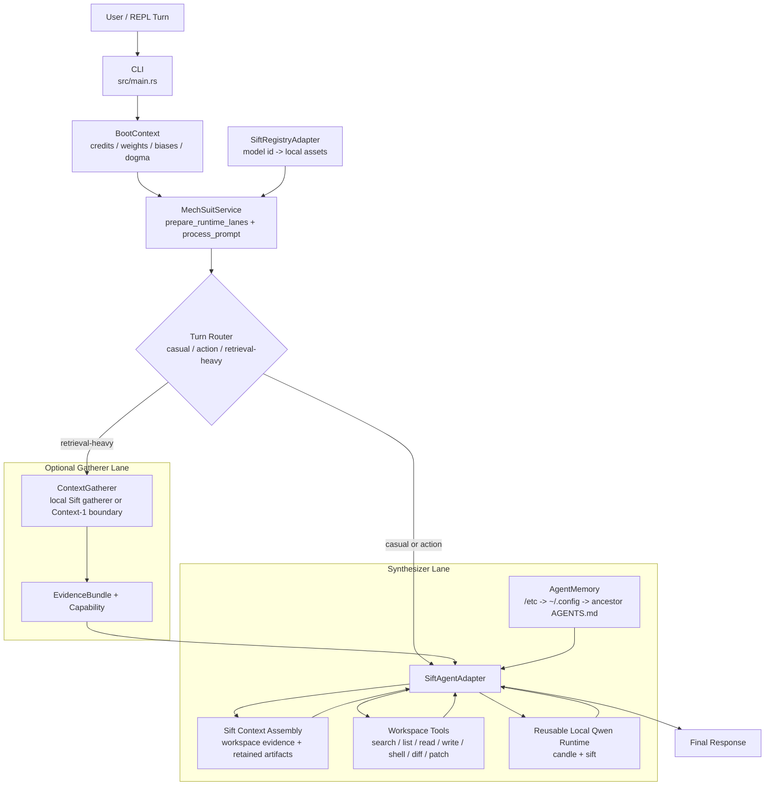

# Paddles: Agentic SDLC Harness & Keel Integration

[](LICENSE)
[](https://nixos.org/guides/how-nix-works)
[](CONSTITUTION.md)
[](.keel/README.md)

> Paddles is your specialized agentic harness, designed to operate within the high-fidelity simulation environment provided by the Keel Engine. It's the mech suit for your AI assistant, enabling turn-based coding tasks with unparalleled precision and verifiable outcomes.

---

## 🚀 Introduction: The Agentic SDLC Simulator

Paddles empowers AI assistants by leveraging the **Keel Engine**, a sophisticated SDLC simulator. Keel provides the underlying "physics" and "circuitry" for development, while Paddles integrates agentic tools and workflows to execute within this framework. Together, they ensure that development adheres to defined architectural constraints, strategic intent, and verifiable specifications.

The core philosophy is **Human-Authoring Physics, Agent-Simulation Execution, and Verification-Confirmation of State**. Humans define the high-level strategy and architecture (the "physics"), while agents perform the tactical execution (the "simulation") within those bounds, with verification confirming the outcome.

Paddles also treats inference as a routing problem, not a single-model problem. Requests should be classified by intent and runtime budget, then routed to the smallest model or toolchain that can satisfy the task. Straightforward conversation and light tool orchestration can stay on small local models; multi-hop context gathering should prefer retrieval systems or a dedicated context-gathering subagent; final synthesis can escalate to a stronger reasoning model only when the runtime supports it.

## 🧭 Internal Architecture & Routing

The current runtime shape is controller-driven. The CLI prepares runtime lanes once, then the application service routes each prompt through the right internal path instead of asking one model to do every job.



Key architectural rules reflected in that flow:

*   The controller owns routing. It decides when a turn stays on the synthesizer lane and when it must gather context first.
*   The gatherer lane returns typed evidence for synthesis. It does not replace the final answer path.
*   The REPL reloads hierarchical `AGENTS.md` memory on every turn, so operator guidance can change without restarting the process.
*   The local Qwen runtime stays loaded, while turn-local prompt state is rebuilt per send.

Current local model defaults are tuned for this repository's constraints rather than model hype. The synthesizer lane now defaults to `qwen3.5-2b` as the stronger generalist local path when enough CUDA memory is actually free, while `qwen-coder-3b` remains available as an opt-in coding-tuned alternative when you want that bias explicitly. If the Qwen3.5 CUDA load or first generation step hits an out-of-memory or reduced-precision runtime failure, `paddles` now logs a warning and retries that lane on CPU instead of crashing the REPL.

## 📜 Foundational Principles & Philosophy

The project operates under a strict set of guiding principles captured in the following documents:

*   **[CONSTITUTION.md](CONSTITUTION.md):** Defines the collaboration model (2-queue pull system), decision hierarchy (ADRs → Epics → Voyages → Stories → Verification → Acceptance), and the goal of minimizing "drift" for high-fidelity simulation.
*   **[POLICY.md](POLICY.md):** Captures the operational invariants and engine constraints that govern the simulator.
*   **[ARCHITECTURE.md](ARCHITECTURE.md):** Details the layered source layout, component responsibilities, entity state machines, and the Verified Spec Driven Development (VSDD) methodology.
*   **[AGENTS.md](AGENTS.md):** Provides operational guidance for AI agents, emphasizing autonomous gardening, pacemaker stability, and strict adherence to procedural loops.
*   **[PROTOCOL.md](PROTOCOL.md):** Defines the communication protocol and data contracts between agents and the engine.
*   **[STAGE.md](STAGE.md):** Outlines the visual philosophy and scene rendering metaphors.
*   **[LICENSE](LICENSE):** The project is licensed under the permissive MIT License.

## ⚙️ Development Environment & Setup

Paddles leverages **Nix** for a reproducible and isolated development environment.

1.  **Install Nix:** If you haven't already, install Nix by following the instructions at [https://nixos.org/download.html](https://nixos.org/download.html).

2.  **Enter the Development Shell:**
    Navigate to the project root and enter the Nix shell:
    ```bash
    nix develop
    ```
    This command will install all necessary dependencies, including the Rust toolchain, CUDA support (if applicable), and other system libraries, ensuring a consistent environment across all contributors.

3.  **Initial Board Health Check:**
    Before starting any development work, it's crucial to ensure the Keel board is healthy. Run the doctor command to diagnose and fix any inconsistencies:
    ```bash
    keel doctor
    ```
    This step is vital for maintaining the integrity of the simulation.

## ▶️ Core Workflows & Usage

Paddles operates using a structured, agentic workflow managed by the Keel Engine.

### 1. The Tactical Loop

Every session follows a deterministic cycle:
    *   **Mission Orientation:** Run `keel mission next --status` to identify high-signal moves. Check `keel flow --scene` for workflow visualization.
    *   **Role Selection:** Operate as either a `manager` (planning/decisions) or an `operator` (implementation). Do not switch roles within a single atomic change.
    *   **Execute Move:** Perform exactly ONE move (e.g., plan a voyage, implement a story, fix a diagnostic).
    *   **Seal Move:** Close the loop by submitting work (`story submit`, `voyage plan`, `bearing assess`) and landing a single sealing commit.
    *   **Log & Commit:**
        *   Record your move in the mission `LOG.md`.
        *   **Pace-setting**: Use `keel poke "Sealing move: <summary>"` when you need to respond to a human/system nudge or explicitly re-energize an idle board before the next scan.
        *   Create a single atomic [Conventional Commit](https://www.conventionalcommits.org/) capturing the resulting board and code state.

### 2. Primary Workflows

*   **Operator (Implementation):** Focus on evidence-backed delivery. Use `keel story show <id>` and `keel voyage show <id>` for context. Implement requirements, record proofs with `keel story record`, and transition with `keel story submit`. Every acceptance criterion must have a proof.
*   **Manager (Planning):** Focus on strategic alignment and unblocking. Use `keel epic show <id>` and `keel flow` for context. Author PRDs, SRSs, SDDs, decompose voyages into stories, and promote voyages with `keel voyage plan` only when requirements are coherent.
*   **Explorer (Research):** Focus on technical discovery and fog reduction. Use `keel bearing list` for context. Fill `BRIEF.md`, collect `EVIDENCE.md`, and conclude with `keel bearing assess`. Graduate to epics only when research is conclusive.

### 3. Building & Testing

*   **Build:**
    ```bash
    just build
    ```
*   **Test:**
    ```bash
    just test
    ```
*   **Quality Checks:**
    ```bash
    just quality  # Formatting and linting
    ```

### 4. REPL Memory Files

The `paddles` REPL reloads `AGENTS.md` memory on every prompt. It searches in this order:

*   `/etc/paddles/AGENTS.md`
*   `~/.config/paddles/AGENTS.md`
*   Every `AGENTS.md` from the filesystem root down to the current working directory

Later files are treated as more specific and override earlier guidance. That means edits to a local project `AGENTS.md` take effect on the next turn without restarting the REPL, and those instructions are injected into both the direct-answer path and the tool-oriented prompt path.

## 🛠️ Key Tools & Components

Paddles integrates these core components within the Keel Engine:

*   **Keel Engine:** Manages the SDLC simulation, state transitions, verification, and collaboration queues. The current version is pinned in `flake.lock`.
*   **Agentic Capabilities:** AI assistants like `wonopcode` (coding), `sift` (retrieval), and `candle` (local AI models) execute tactical tasks. Search and context-gathering models should be treated as retrieval subagents that gather and rank evidence; answer models should synthesize the final response from that evidence.
*   **Nix:** Manages the development environment for reproducibility.
*   **Git:** Used for version control and audit logging, with commits adhering to Conventional Commits.

## 🩺 Keel Health & Diagnostics

Keel provides tools to diagnose and maintain the system's health:

*   **`keel doctor`:** Validates board integrity and fixes inconsistencies. **Must be run at the start of every session.**
*   **`keel health --scene`:** Provides a high-level visual scan of subsystem health (NEURAL, MOTOR, STRATEGIC, etc.).
*   **`keel flow --scene`:** Visualizes the workflow lanes and identifies blockages or available work.

## 🚀 Release Process

The project follows Semantic Versioning 2.0.0. A release requires:
*   All tests passing.
*   A healthy Keel board (`keel doctor`).
*   All relevant stories accepted.
*   An updated `CHANGELOG.md`.

## ⚖️ License

This project is licensed under the **MIT License**. See the [LICENSE](LICENSE) file for details.

---

_Paddles: Enabling agentic SDLC with verifiable outcomes, guided by human strategy._
