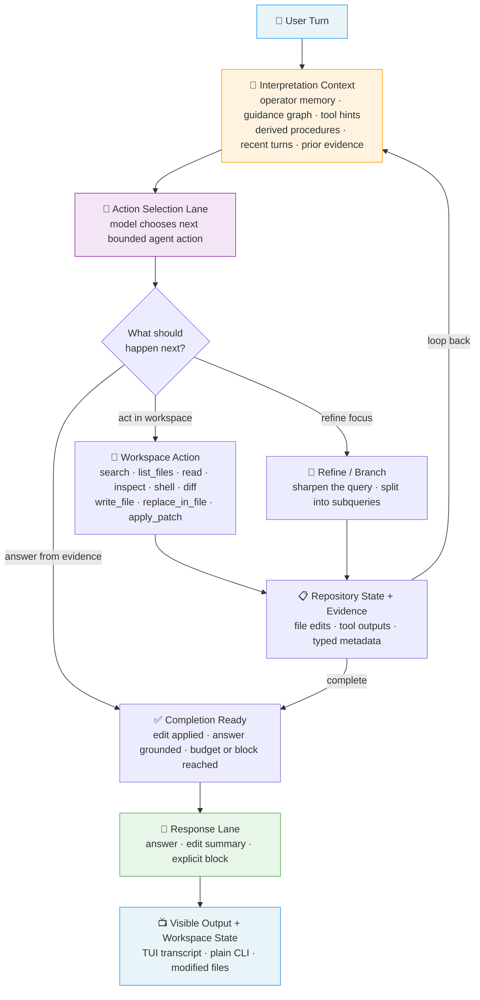
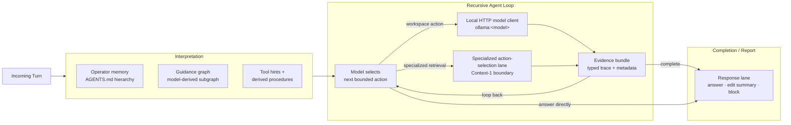
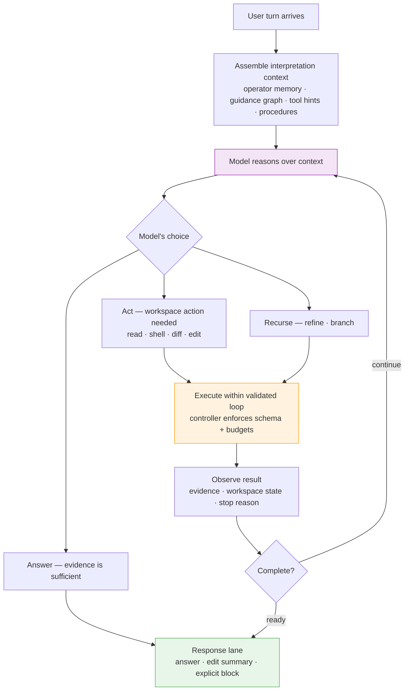
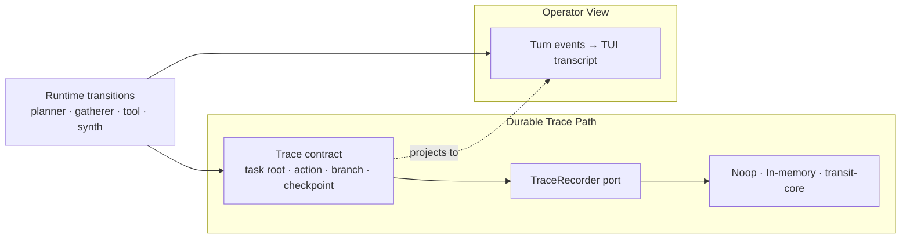
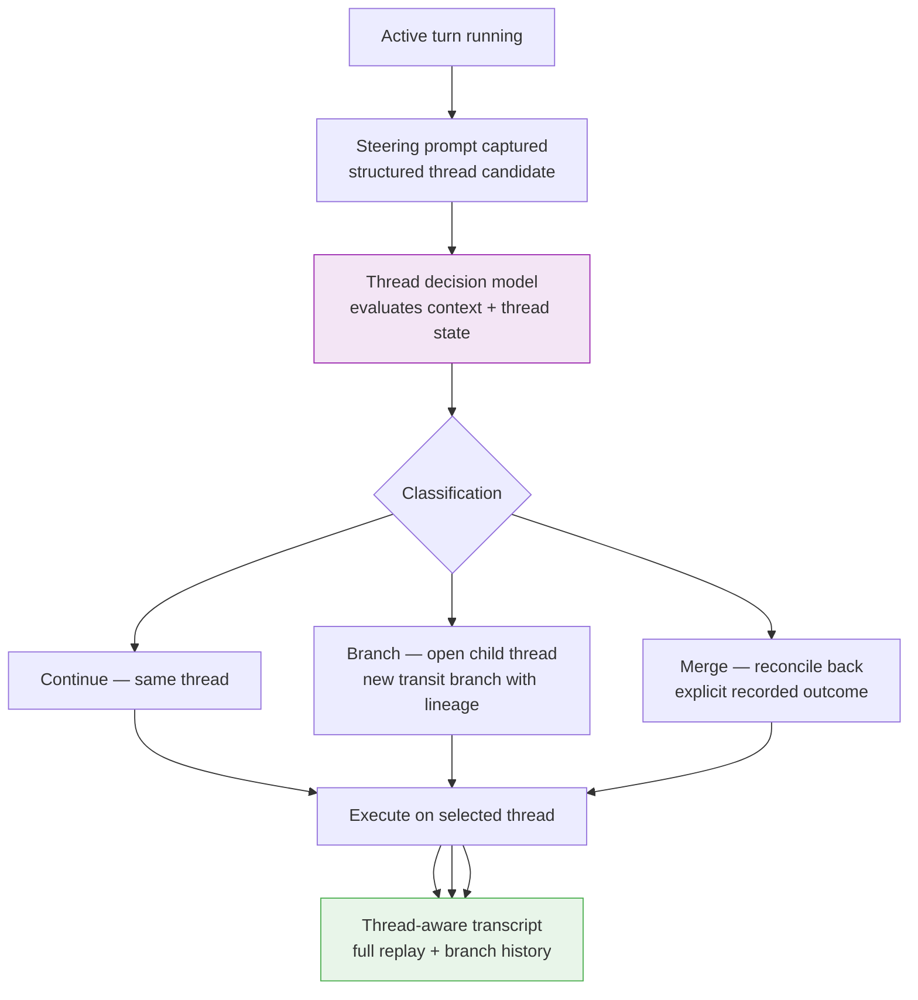

# Paddles: Recursive Coding Agent Loop

[](.keel/README.md)
[](https://github.com/spoke-sh/paddles/actions/workflows/ci.yml)

> `paddles` is a coding agent that can run against local or remote HTTP model
> services and be embedded as a Rust library. Its backbone architecture is one
> recursive agent loop: operator memory shapes turn interpretation, model
> reasoning is the planning, and the model selects bounded agent actions until
> Paddles can apply code edits, answer source-grounded codebase questions, or
> report an explicit block.

## Backbone Architecture

The architecture rests on five commitments:

- **Let model reasoning be the planning.** Interpretation context — operator memory, guidance graphs, tool hints, derived procedures — arrives before action selection. The model sees the full picture and chooses its own next bounded agent action inside the recursive agent loop.
- **Disclose live capabilities and constraints before action selection.** The harness
  exposes its dynamically available recursive capabilities, execution posture,
  and completion contract to the model before asking it to decide what to do
  next, and leaves enough recursive budget for the model to reason with them.
- **Earn code changes and answers through recursive work.** Small models become dramatically more capable when the harness gives them bounded tools to inspect, edit, verify, and gather evidence iteratively rather than answering in one shot.
- **Separate action selection from response authoring.** Recursive repository work and user-facing response generation are distinct workloads, each routed to the smallest model that excels at that role. The response lane reports what happened; it is not the only purpose of the turn.
- **Keep every step visible.** The harness shows its recursive work — agent actions, evidence gathered, decisions made — so the operator always knows why an outcome was produced.

### The Turn Loop

Every interaction follows the same recursive cycle. The harness assembles context, the model reasons over that context, chooses one bounded agent action, and the controller validates and executes that action. The loop continues until the requested repository work is done, the codebase question can be answered from evidence, or the turn must stop explicitly.



This is the heart of Paddles: a bounded recursive agent loop where the model drives
its own repository work within explicit harness guardrails. Each pass through
the loop can add evidence, inspect runtime state, apply an edit, verify a
change, or narrow the question. The response lane is the user-facing handoff
after that work; the harness should not collapse the planner's reasoning into
generic controller-authored pseudo-plans.

### Bounded Action Contract

Paddles is close to a traditional ReAct loop in shape: reason, choose one
action, observe the result, and repeat. The difference is that Paddles makes the
action surface typed, capability-disclosed, budgeted, and locally executed by
the controller.

The shared agent action schema renderer is the JSON action contract's one
owner. It lives in `src/application/planner_action_schema.rs` and emits the
canonical first-action and later-action variants, including action names, JSON
examples, required fields, and common selection rules. Sift/local and
HTTP/remote action-selection prompts embed that same rendered block. Adapter
prompts may add transport mechanics, but they do not author their own action
lists.

That schema is separate from the turn-specific capability manifest. The schema
defines which JSON envelopes are valid; the manifest tells the recursive agent
loop which retrievers, semantic actions, external capability fabrics, execution
constraints, budgets, and completion requirements are available for this turn.

The canonical recursive agent actions are:

| Action | Purpose | Mutates workspace |
| --- | --- | --- |
| `answer` | Produce a user-facing answer when current evidence is sufficient. | No |
| `search` | Retrieve local context through the configured repository retriever. | No |
| `list_files` | Enumerate candidate workspace paths within the repository boundary. | No |
| `read` | Open a specific workspace file or retained artifact. | No |
| `inspect` | Run one read-only probe through the terminal boundary. | No |
| `shell` | Run a governed workspace command when a command should execute now. | Maybe |
| `diff` | Inspect current workspace diffs. | No |
| `write_file` | Replace an entire workspace file with authored contents. | Yes |
| `replace_in_file` | Apply an exact in-file text replacement. | Yes |
| `apply_patch` | Apply a bounded patch directly to the workspace. | Yes |
| `semantic_definitions`, `semantic_references`, `semantic_symbols`, `semantic_hover`, `semantic_diagnostics` | Query semantic workspace evidence when the active capability manifest discloses that service. | No |
| `external_capability` | Invoke a manifest-disclosed external fabric such as `web.search`, `mcp.tool`, or `connector.app_action`. | No local workspace mutation |
| `refine` | Retarget retrieval or focus while keeping the current trace. | No |
| `branch` | Split the turn into bounded subquestions or branches. | No |
| `stop` | End with an explicit reason, block, or insufficiency report. | No |

Terminal `answer` and `stop`, concrete workspace actions, semantic actions, and
`external_capability` all live in this one recursive action vocabulary. The
active capability manifest gates which backing services are available, and the
controller still owns validation, execution, budgets, and fail-closed behavior.

### Model Routing

Each phase of the turn flows to the smallest model capable of that workload. A
more capable action-selection lane may drive recursive repository work. A
lightweight response authoring lane turns the resulting trace into an answer,
edit summary, or explicit block for the operator.



### The Recursive Harness in Practice

The primary mech-suit path assembles interpretation context first, then lets the
model choose each bounded agent action. Model reasoning is the planning inside
the recursive agent loop. The controller validates, executes, and enforces
budgets - the model drives direction, the controller ensures safety. Intent
routing no longer comes from controller-side prompt token guesses; terminal
direct answers are `answer` or `stop` actions in the same loop, not a separate
direct-answer path. The model decides when a turn should answer, inspect or
modify the workspace, refine its focus, branch, or stop.



### Steering Signals

Paddles does not rely on one generic control score. It runs a family of controller-owned steering signals that bias the loop when evidence starts to matter more than priors.


The systems serve different jobs:

- **Context strain** reports degraded assembled context when memory, retained artifacts, thread summaries, or evidence budgets are truncated.
- **Action bias** injects a steering-review note back into the planner when an edit-oriented turn keeps avoiding file action, so the model must judge whether to read, diff, or edit a likely target now.
- **Deterministic entity resolution** self-discovers authored workspace paths for edit-oriented hints before broad search or mutation and records whether the target resolved, remained ambiguous, or went missing.
- **Known-edit headroom** keeps edit turns bounded but leaves enough read/inspect/search budget to inspect a few candidate files before the workspace-editor boundary closes the loop.
- **Premise challenge** injects a steering-review note back into the planner when gathered sources start to outweigh the original premise, so the model must decide whether to stop, revise, or keep investigating.
- **Harness profiles** make steering, compaction, and execution governance explicit. Paddles now resolves a versioned profile from capability surfaces instead of provider names: `recursive-structured-v1` stays active when planner and render transports stay structured, while `prompt-envelope-safe-v1` is an explicit downgrade when prompt-envelope recovery or rendering is required. The active profile also declares the sandbox mode, approval policy, and bounded permission-reuse scopes that local execution hands may rely on.
- **Compaction cue** keeps the active context tight by summarizing or pruning low-value artifacts while preserving locators to the deeper record. The active harness profile now owns the bounded compaction budget instead of leaving that policy as an invisible provider-shaped heuristic.
- **Specialist brains** stay bounded and optional. They consume the same session-queryable slices and harness-profile contract as the recursive planner, then contribute runtime notes back into the planner request instead of opening a parallel architecture. The built-in `session-continuity-v1` brain only activates when the active profile supports it and otherwise records a clear unavailability note.
- **Budget boundary** terminates recursive work when step, search, inspect, or read caps have been reached.

The important invariant is that steering signals become stronger as real evidence accumulates. A user claim can start the investigation, but gathered sources get the final say.

### Web Trace Routes

The web UI exposes three complementary trace routes:

- `/` — the forensic inspector, which is now a machine-first detail surface over recorded transit artifacts: atlas first, then a narrative detail drawer for the selected moment, with a `Show internals` escape hatch for raw payloads and ids
- `/manifold` — the steering-gate manifold, which folds raw steering signals into three gate families (`evidence`, `convergence`, `containment`) and visualizes them as a temporal force field across time, gate family, and magnitude
- `/transit` — the snake-style turn-step trace, optimized for turn lineage and step sequencing

The important architectural limit is that the manifold route is still metaphorical. It is a projection over exact recorded trace artifacts, not an extra hidden reasoning layer. Every selected gate state must be able to reveal its underlying source record and route back to the precise forensic inspector.

When the selected source is a deterministic resolver outcome, the manifold readout now shows whether the target was `resolved`, `ambiguous`, or `missing`, along with the authored path or candidate set that produced that state. This keeps edit convergence visible without turning the manifold into a second editor.

The next trace-surface simplification is a shared narrative-machine vocabulary for transit and forensic views. In the default operator path, the UI should talk about machine parts such as `Input`, `Evidence probe`, `Diverter`, `Jam`, `Spring return`, `Force`, and `Output` instead of exposing raw trace-storage labels like record kinds, nodes, or payload families first.

That simplified path also shares one interaction model across both routes:

- selected turn
- selected moment
- optional internals mode

Internals still preserve raw ids, payloads, and evidence links, but they sit behind an explicit `Show internals` operator choice instead of dominating the first-read surface. The default forensic route should answer three questions before it reveals raw payloads: why the selected moment mattered, which steering forces shaped it, and what changed in artifact lineage around it.

The frontend is now staged through a shared Turborepo workspace:

- `apps/docs` owns the Docusaurus documentation site
- `apps/web` owns the TanStack-routed runtime application

The Rust server now serves the built React runtime directly on the primary web routes `/`, `/transit`, and `/manifold`. There is no iframe proxy layer and no secondary `/app` or `/legacy` route family. The product path, the browser E2E path, and the frontend build artifact now share the same route ownership.

The runtime browser contract is now projection-first:

- `GET /session/shared/bootstrap` returns the shared conversation id plus the canonical initial projection
- `GET /sessions/{id}/projection/events` is the single live stream for that session, carrying both projection rebuilds and turn-progress events
- the React runtime owns one shared projection store, so chat, transit, and manifold all render from the same conversation snapshot instead of stitching together panel-local fetch paths

The same bootstrap and health surfaces now expose `execution_hands` alongside
transport readiness. Operators can inspect the shared workspace editor,
background terminal runner, and transport mediator hand phases without digging
through provider-specific logs.

Those same local execution boundaries now share one explicit governance
vocabulary as well: sandbox mode, approval policy, permission requirements,
escalation requests, and structured allow or deny outcomes. That keeps shell,
workspace-edit, and future hands on one hand-agnostic contract instead of
provider-specific branches.

The terminal runner and workspace editor now execute through one shared
permission gate. If the active posture does not allow a request, the runtime
fails closed before any side effect and returns a structured deny or escalation
result instead of widening authority implicitly.

That posture is no longer hidden inside controller code. Each turn now emits a
typed execution-governance posture snapshot plus per-action allow, deny, or
escalation decisions into the runtime event stream and durable trace. Transcript
and web projections replay those records as system policy rows, and downgraded
profiles such as `prompt-envelope-safe-v1` surface their disabled features
explicitly instead of silently pretending full parity.

Collaboration mode follows the same projection rule. Planning mode, execution,
and review requests now resolve into typed mode results with explicit `applied`,
`defaulted`, `invalid`, or `unavailable` status. When planning mode halts
before mutation, the structured clarification request is replayable as its own
runtime/trace record instead of collapsing into an untyped conversational
detour.

External capability fabrics now follow the same rule. When the recursive
harness discovers or invokes `web.search`, `mcp.tool`, or
`connector.app_action`, the runtime projects one shared vocabulary across the
event stream, transcript, and trace: `fabric=...`, `status=...`,
`availability=...`, `auth=...`, `effects=...`, and `provenance=...`. Degraded,
denied, stale, or unavailable outcomes stay explicit instead of collapsing into
generic "tool done" success rows.

The `transport_mediator` is now the only runtime boundary that resolves remote
provider API keys and native-transport bearer tokens. Local shell and
workspace-diff/apply child processes have those credential env vars stripped
before they spawn, so generated commands do not inherit authority they did not
explicitly need.

### Native Transport Substrate

Native transport delivery now starts from one shared substrate instead of one-off protocol adapters. The authored configuration layer names four transport slots:

- `http_request_response`
- `server_sent_events`
- `websocket`
- `transit`

The first concrete slices on that substrate are:

- `http_request_response` for one-shot local request/response integrations
- `server_sent_events` for server-push streams on the shared runtime web surface
- `websocket` for bidirectional session-oriented exchanges on that same listener
- `transit` for structured request/response exchanges on that same shared listener

Each slot flows through the same operator-facing diagnostics model before protocol-specific behavior is added. The shared diagnostics surface always answers the same questions first:

- is the transport enabled
- what `phase` is it in
- which `bind_target` is it trying to own
- which `auth_mode` is negotiated
- what `last_error` most recently pushed it out of readiness

Operators should inspect those diagnostics through `GET /health` or `GET /session/shared/bootstrap` before they reason about protocol-specific behavior. When HTTP request/response, SSE, WebSocket, and Transit are enabled together, they must converge on the same `bind_target` because the runtime serves them through one shared listener. WebSocket now records negotiated session identity through `session_ready` plus a shared `connection_id`, while Transit uses `POST /native-transports/transit` with `application/transit+json` payloads and returns explicit `turn_response` or `transport_error` frames under the same diagnostics contract.

That shared substrate is what later HTTP, SSE, WebSocket, and Transit stories extend. Operators should not have to learn a different readiness or failure vocabulary for each transport.

### Trace Recording

Every recursive step produces typed trace records alongside the visible transcript. The UI is a projection; durable lineage lives in the recorder boundary.



### Threaded Conversations

Interactive sessions maintain one durable conversation root. When a steering prompt arrives mid-turn, the planner classifies it as continuation, child-thread, or merge-back — preserving full lineage for replay.



## What The Harness Delivers Today

The recursive harness runs as a bounded local-first runtime:

- **Interpretation-first action selection** — every turn assembles operator memory, a model-derived guidance subgraph, read-only tool hints, and derived decision procedures before the model chooses its first bounded agent action
- **Model-driven action selection** — the model chooses from terminal `answer`/`stop`, workspace actions (`search`, `list_files`, `read`, `inspect`, `shell`, `diff`, `write_file`, `replace_in_file`, `apply_patch`), semantic actions, `external_capability`, `refine`, or `branch`
- **Guidance-aware fallbacks** — fallback selection draws on command hints and decision procedures from foundational docs, and halts recursion when a procedure step has already resolved the request
- **Bounded recursive loop** — workspace actions, refinements, and branches all feed back into the recursive agent loop until evidence is sufficient or budgets are met
- **Separate response authoring** — a distinct response lane turns the accumulated trace into a grounded answer, edit summary, or explicit block
- **Full-stream visibility** — a default TUI/event stream shows interpretation, first agent actions, retrieval, fallbacks, edits, and response authoring as they happen, while low-value direct-response bookkeeping stays behind higher verbosity
- **Shared verbosity contract** — one resolved `0/1/2/3` verbosity level governs both the TUI transcript and the web event stream: `0` is the default operational view, `1` adds info-tier planner metadata, `2` adds debug-tier routing/capability detail, and `3` enables trace diagnostics
- **Typed collaboration modes** — planning mode, execution, and review selection plus blocked-mutation clarification requests project through the same turn-event and durable-trace vocabulary instead of living only in prompts
- **Steering-signal control** — context strain and budget boundary remain controller-owned, while premise challenge and action bias now trigger recursive planner review passes over the current sources instead of hard-coded redirects
- **Durable trace lineage** — a paddles-owned trace contract with stable task/turn/record/branch/checkpoint ids, backed by a `TraceRecorder` boundary whose default runtime posture now prefers embedded `transit-core` and degrades to bounded in-memory recording only when persistence cannot be opened locally
- **Session wake and slice contract** — the recorder boundary now defines how a harness wakes a prior task, resumes from checkpoints, and interrogates deterministic replay slices without falling back to ad hoc prompt summaries
- **Artifact envelopes** — prompts, tool I/O, evidence bundles, planner traces, and responses sit behind logical refs, ready for external storage when needed
- **Threaded conversations** — interactive sessions keep one durable root task with model-driven steering-thread decisions, structured thread candidates, explicit merge-back records, and full replay views
- **Four-tier context model** — context spans Inline, Transit, Sift, and Filesystem tiers with typed `ContextLocator` addressing and lazy cross-tier resolution through a `ContextResolver` port
- **Transit-native addressing** — truncated `ArtifactEnvelope` content carries typed locators to full records in transit or on disk, resolvable on demand without re-searching
- **Compaction planning with locators** — retained artifacts can be summarized or pruned while preserving locators for depth; the current compaction path is bounded and heuristic even though the interface is shaped for richer recursive self-assessment
- **Context strain signals** — a `StrainTracker` accumulates truncation events during context assembly and emits `ContextStrain` turn events so context degradation is visible in the event stream
- **Evidence-judgement stops** — when gathered sources weaken a user-stated failure premise, the controller re-enters the planner with a premise-challenge review note so the model can stop, revise, or continue explicitly
- **In-flight visibility** — the TUI inserts contextual "Planning...", "Synthesizing...", etc. rows after 2s of silence between events, so long model calls don't look stalled
- **Shared conversation primitives** — an internal workspace crate ([crates/paddles-conversation/src/lib.rs](/home/alex/workspace/spoke-sh/paddles/crates/paddles-conversation/src/lib.rs)) cleanly separates conversation/thread/session types from the main binary

### Growing Edges

A few areas are still maturing:

- **Sift-tier locator resolution** — typed `ContextLocator::Sift` values are emitted from retrieval; direct Sift resolver wiring is still being finalized
- **Automatic tier promotion** — content moves between tiers through explicit locators; automatic promotion/demotion policies are future work
- **Recorder fallback visibility** — when the persistent session spine cannot open, Paddles degrades to in-memory recording and tells the operator exactly why at boot
- **Context-1 integration** — `context-1` remains an explicit experimental boundary, available for opt-in use
- **Concurrent threading** — auto-threading is checkpoint-bounded and sequential today; true concurrent sibling generation is a future capability

### Durable Session Operations

The recorder boundary now names four storage-neutral session operations:

- `wake(task_id)` returns the latest record position plus the available checkpoint cursors for that task
- `replay(task_id)` returns the full ordered lineage for that task
- `resume_from_checkpoint(task_id, checkpoint_id)` returns the forward replay slice anchored at the named checkpoint
- `replay_slice(task_id, request)` returns a forward or backward slice anchored at a task root, turn, branch, record, checkpoint, or tail
- `query_session_context(task_id, query)` returns an explicit adaptive-replay, rewind, or compaction window slice with transcript entries and turn summaries

Those semantics are stable across recorder adapters. Embedded `transit-core` is now the default session spine and persists under machine-managed local state. When that persistent path cannot be opened, Paddles falls back to in-memory recording with the same wake/replay/slice contract and an explicit degraded-session warning.

`query_session_context(...)` is the higher-level harness seam. Today it exposes three explicit slice modes:

- `AdaptiveReplay { turn_limit }` selects the most recent completed turns as replayable transcript context
- `Rewind { anchor, record_limit }` walks backward from a deterministic trace anchor without rebuilding the whole prompt window
- `CompactionWindow { anchor, before_record_limit, after_record_limit }` returns a bounded neighborhood around an anchor so compaction logic can prune or summarize without destructive prompt-only summaries

## Design Principles

- **Interpretation shapes direction.** `AGENTS.md` memory influences what the planner investigates, how it prioritizes, and which procedures it follows.
- **The model drives, the controller guards.** Model reasoning is the planning: the model selects its next bounded agent action from interpretation context; the controller validates, executes, and enforces budgets.
- **Conversation continuity is shared, not inferred twice.** Action-selection and response lanes receive the same recent-turn and active-thread handoff, so follow-up turns do not reset just because the response path changed.
- **Recursive work earns better outcomes.** Difficult codebase questions and edits improve through iterative evidence gathering rather than one-shot generation.
- **Separation of concerns.** Action selection and response authoring are distinct roles, potentially using different models optimized for their respective workloads.
- **Context over hardcoding.** Keel, project artifacts, and board state flow through memory, search, and tool outputs — the harness stays general-purpose.
- **Local-first by default.** The core loop can run against local HTTP model
  services. Heavier hosted action-selection lanes are opt-in and degrade
  gracefully.
- **Hands stay explicit.** Workspace editing, background terminal execution, and credential-bearing transport mediation share one execution-hand lifecycle instead of inventing adapter-local state names.
- **Visible execution.** Every recursive step is surfaced to the operator. The harness shows its work because transparency builds trust.

## Current Runtime Lanes

> Migration note: [ADR VJZBM9Guy](.keel/adrs/VJZBM9Guy/README.md) makes HTTP
> model clients the only supported inference boundary for action selection and
> final rendering. Local-first inference should run through a local HTTP model
> service such as Ollama and use the `ollama:<model>` provider form. Sift remains
> a retrieval/indexing concern until a separate decision changes that boundary.

- The response model defaults to the configured HTTP model client. Local-first
  users should run a local HTTP model service and select it with
  `ollama:<model>`.
- Authored `paddles.toml` can define `[shared]`, `[synthesizer]`, and `[planner]` model sections. `shared` is the default fallback for both lanes when the specific section does not set its own provider/model.
- The planner lane is the configurable action-selection lane. It defaults to the shared provider/model unless `--planner-provider <provider>` and `--planner-model <id>` select a different planner-capable lane.
- Remote providers can stay logged in side-by-side. In the TUI, use `/login <provider>` to add credentials for any supported provider and `/model` to inspect the active lanes or switch the shared runtime selection.
- OpenAI-compatible remote action-selection lanes now select bounded workspace actions through native tool calls, while Paddles still executes those actions locally inside the repository harness.
- Remote provider behavior now resolves from one negotiated capability surface per provider/model pair: HTTP wire format, response render contract, planner tool-call shape, and transport support. Adding a future provider should extend that surface instead of forking controller logic by provider name.
- Successful `/model` changes persist to the machine-managed runtime state file at `~/.local/state/paddles/runtime-lanes.toml` so they survive restarts without rewriting authored `paddles.toml`.
- Local `sift` search artifacts now live under the machine-managed cache root at `~/.cache/paddles/sift/workspaces/<workspace-key>` instead of inside the repo workspace, so search does not index its own cache on restart.
- That runtime lane state overrides authored model-lane config on startup, while non-lane settings like `port` still come from layered config and CLI flags still win over everything.
- Inception is available through the same OpenAI-compatible HTTP lane used by the core remote providers. Authenticate with `/login inception`, then select the supported core model path with `/model inception mercury-2`.
- `mercury-2` remains the supported Inception planner/synthesizer chat model. Workspace edits still execute locally through the shared workspace editor boundary, so provider selection does not change `apply_patch` semantics.
- Provider-native streaming/diffusion views remain optional follow-on capabilities; they are still not required to use Inception in `paddles`.
- Legacy local Sift model-provider selections are migration-only inputs. They
  should fail with an `ollama:<model>` migration hint instead of being silently
  remapped to another provider.
- `sift-direct` is the default local gatherer/search backend used by `search` and `refine` agent actions.
- `paddles` owns the recursive agent loop. `sift` executes direct retrieval only.
- `search` and `refine` actions carry bounded retrieval mode and strategy into the gatherer boundary.
- Gatherer progress now reflects direct retrieval stages such as initialization, indexing, retrieval, and ranking.
- `context-1` remains an explicit experimental planner/gatherer boundary and stays fail-closed until its harness is real.

## Search And Retrieval

Search behavior is documented in [SEARCH.md](SEARCH.md).

Use that document when you need the retrieval boundary, provider names, capabilities, or constraints. The short version is:

- `paddles` plans
- `sift` retrieves
- `sift-direct` is the active local retrieval backend

## Foundational Documents

Use these in this order when reading the foundational stack:

1. [AGENTS.md](AGENTS.md) for operator guidance and the top-level working contract
2. [INSTRUCTIONS.md](INSTRUCTIONS.md) for the canonical Keel turn loop and checklists
3. [README.md](README.md) for the backbone architecture and navigation map
4. [CONSTITUTION.md](CONSTITUTION.md) for collaboration philosophy and bounds
5. [POLICY.md](POLICY.md) for operational commitments and runtime guarantees
6. [ARCHITECTURE.md](ARCHITECTURE.md) for the turn loop narrative and implementation map
7. [PROTOCOL.md](PROTOCOL.md) for communications and data contracts
8. [SEARCH.md](SEARCH.md) for search/retrieval behavior, constraints, and provider semantics
9. [CONFIGURATION.md](CONFIGURATION.md) for concrete lane/runtime configuration

Supplementary references:

- [STAGE.md](STAGE.md) for visual philosophy
- [RELEASE.md](RELEASE.md) for release process
- [.keel/adrs/](.keel/adrs/) for binding architecture decisions

This reading order is not the same thing as the decision hierarchy. For ambiguous design decisions, defer to ADRs first, then Constitution, Policy, Architecture, and current planning artifacts.

## Working With The Board

Use the raw `keel` CLI directly.

The normal operator rhythm is:

1. Orient with `keel health --scene`, `keel flow --scene`, and `keel doctor`.
2. Inspect with `keel mission next`, `keel pulse`, and `keel workshop`.
3. Pull one slice with `keel next --role <role>` or by following the active mission/story explicitly.
4. Ship the slice and land a sealing commit.
5. Re-orient immediately after the commit.

## Development Setup

Enter the default CPU-first dev shell:

```bash
nix develop
```

On Linux, the dev shell provides `chromium` for Playwright-driven browser tests.
On macOS, nixpkgs does not ship that package, so Playwright uses its own managed
browser download after `npm ci`.

Use the explicit CUDA shell only when you actually want GPU builds or runtime:

```bash
nix develop .#cuda
```

Build and test:

```bash
just build
just test
just quality
```

`just quality` now covers both the Rust checks and the shared frontend workspace lint path. `just test` covers `cargo nextest`, the frontend workspace unit/build path, and browser E2E for the docs app plus the TanStack runtime on the primary product routes `/`, `/transit`, and `/manifold`. The runtime browser suite now keeps the page open, injects a turn from outside the page against the shared session, and verifies live transcript, transit, manifold, and reload continuity.

Check board health:

```bash
keel doctor
keel flow --scene
```

Run the interactive assistant:

```bash
just paddles
```

Opt into the GPU lane explicitly:

```bash
just paddles --cuda
```

Use a heavier action-selection model while keeping a lighter final-rendering
model:

```bash
paddles --model ollama:<model> --planner-model openai:gpt-5.4
```

One-shot prompt mode stays plain for scripts:

```bash
paddles --prompt "Summarize the current runtime lanes"
```

## REPL Memory

`paddles` reloads `AGENTS.md` memory on every turn from:

1. `/etc/paddles/AGENTS.md`
2. `~/.config/paddles/AGENTS.md`
3. every ancestor `AGENTS.md` from filesystem root to the current workspace

Later files are more specific. That memory now participates in turn interpretation before recursive agent action selection, and additional guidance is loaded through a turn-time model-derived subgraph rooted at `AGENTS.md` rather than a hardcoded foundational file list.

## Why This Architecture

Paddles raises the effective performance of smaller local models through recursive resource use. A small model with bounded tools and iterative evidence gathering consistently outperforms the same model answering in one shot.

That is the contract:

- **Human-authored guidance** shapes every turn through operator memory and derived procedures
- **Bounded recursive agent-loop reasoning** lets the model investigate iteratively within safe guardrails
- **Explicit evidence accumulation** grounds answers and edits in real workspace artifacts
- **Separate response authoring** optimizes repository work and user-facing reporting independently
- **Visible execution** makes every decision transparent and auditable

## Roadmap / Not Yet Shipped

The sections above describe the shipped runtime today. The following capabilities are referenced in design notes elsewhere in the repository but are **not yet wired**; treat any prose claims about them as aspirations until the corresponding mission lands:

- **Real subagents** with their own context windows. A `subagents` registry slot exists in the runtime profile, but only `session-continuity-v1` is active today and it contributes runtime *notes* rather than autonomous decisions.
- **MCP server discovery and invocation.** The external-capability catalog declares an `mcp.tool` descriptor that reports `unavailable` until an MCP transport adapter ships.
- **Plan-mode review/approve UX.** `/plan` is registered as a discoverable slash command; the proposed-action review panel and approve/decline gating are scaffolded for a follow-up slice.
- **Automatic tier promotion / demotion** of context locators. Content moves between tiers through explicit locators today; automatic policies are future work.
- **True concurrent sibling generation.** Threading is checkpoint-bounded and sequential today.
- **Operator-triggered context compaction** (`/compact`). The runtime profile already governs compaction policy; an explicit operator-triggered control is pending.

## License

MIT. See [LICENSE](LICENSE).
