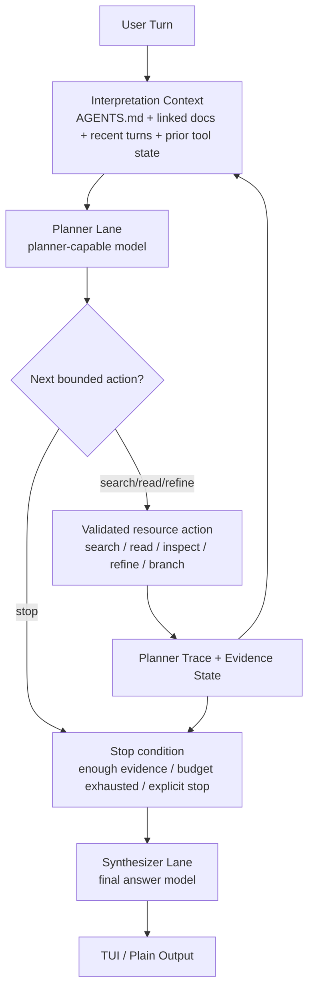
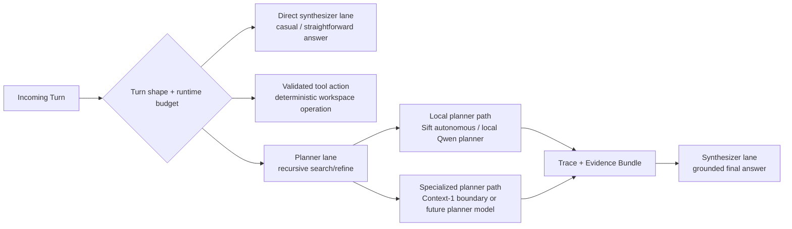

# Paddles: Recursive In-Context Planning Harness

[](LICENSE)
[](https://nixos.org/guides/how-nix-works)
[](.keel/README.md)

> `paddles` is the mech suit around a local-first coding agent. Its backbone architecture is a recursive in-context planning harness: operator memory shapes turn interpretation, a planner model recursively gathers and refines evidence through bounded resource use, and a separate synthesizer model produces the final answer from that trace.

## Backbone Architecture

The central idea is simple:

- do not hardcode domain-specific turn types as the primary reasoning engine
- do not ask one small model to answer before it has done enough recursive context work
- do not treat retrieval and final answering as the same workload

Instead, `paddles` should behave like a bounded recursive harness.

### Recursive Loop



### Model Routing

Routing is workload-specific. The point is not to find one default model for everything. The point is to route each phase of the turn to the smallest capable lane.



### Role Of Keel

Keel is important, but it is not supposed to become a first-class special-case runtime intent. It is one evidence domain inside the workspace. Mission files, charters, PRDs, voyage docs, and board commands should be reachable through the same recursive context mechanisms as source files and tool outputs.

That is why the next architecture step is not “add a board intent.” It is “make the planner better at using recursive context.”

## Current Implementation Snapshot

The repository is mid-transition toward that backbone.

Today, the runtime already has useful pieces:

- a local-first synthesizer lane
- a gatherer/synthesizer split
- hierarchical `AGENTS.md` memory reload on every turn
- a default TUI with visible turn events
- Sift-backed autonomous gathering for some repository questions

But the current implementation is still more rigid than the backbone above:

- interpretation is still controller-first for many turns
- `AGENTS.md` currently influences prompt construction more than first-pass routing
- repository questions usually get one gather step, not a true recursive planner loop
- the final answer path is still stronger than the planner path, rather than clearly separate from it

That migration is tracked by mission [VFDv1ha1G](.keel/missions/VFDv1ha1G/README.md) and epic [VFDv1i61H](.keel/epics/VFDv1i61H/README.md).

## Design Principles

- `AGENTS.md` should influence interpretation, not just answer style.
- Recursive context refinement should do the heavy lifting for difficult workspace questions.
- Planner and synthesizer are different roles and may use different models.
- Keel and other project-specific artifacts are context, not hardcoded product logic.
- Local-first remains the default. Heavier planner lanes must degrade safely.
- Operator-visible traces matter. The harness should show its recursive work.

## Current Runtime Lanes

The current repo still exposes the existing synthesizer/gatherer topology while the recursive planner mission is in progress.

- The synthesizer lane defaults to `qwen-1.5b`.
- `qwen-coder-0.5b`, `qwen-coder-1.5b`, `qwen-coder-3b`, and `qwen3.5-2b` remain available as opt-in variants.
- `sift-autonomous` is the current local gatherer provider for retrieval-heavy turns.
- `context-1` is still an explicit experimental planner/gatherer boundary and remains fail-closed until its harness is real.

The long-term direction is to treat those as interchangeable planner/synth providers behind stable contracts instead of baking routing assumptions into one controller path.

## Foundational Documents

Use these in this order when interpreting the mech suit:

- [AGENTS.md](AGENTS.md) for operator guidance and the canonical turn loop
- [README.md](README.md) for the backbone architecture and document map
- [ARCHITECTURE.md](ARCHITECTURE.md) for the detailed target/current architecture split
- [POLICY.md](POLICY.md) for runtime invariants and safety rules
- [INSTRUCTIONS.md](INSTRUCTIONS.md) for procedural Keel loops
- [CONFIGURATION.md](CONFIGURATION.md) for lane/runtime configuration
- [PROTOCOL.md](PROTOCOL.md) for communications and data contracts
- [CONSTITUTION.md](CONSTITUTION.md) for collaboration philosophy and decision hierarchy

## Working With The Board

Use the raw `keel` CLI directly.

The normal operator rhythm is:

1. Orient with `keel health --scene`, `keel flow --scene`, and `keel doctor --status`.
2. Inspect with `keel mission next --status`, `keel pulse`, and `keel workshop`.
3. Pull one slice with `keel next --role <role>` or by following the active mission/story explicitly.
4. Ship the slice and land a sealing commit.
5. Re-orient immediately after the commit.

## Development Setup

Enter the dev shell:

```bash
nix develop
```

Build and test:

```bash
just build
just test
just quality
```

Check board health:

```bash
keel doctor --status
keel flow --scene
```

Run the interactive assistant:

```bash
just paddles --cuda
```

One-shot prompt mode stays plain for scripts:

```bash
paddles --prompt "Summarize the current runtime lanes"
```

## REPL Memory

`paddles` reloads `AGENTS.md` memory on every turn from:

1. `/etc/paddles/AGENTS.md`
2. `~/.config/paddles/AGENTS.md`
3. every ancestor `AGENTS.md` from filesystem root to the current workspace

Later files are more specific. The recursive planner mission will push this one step further by making that memory part of turn interpretation rather than only late prompt shaping.

## Why This Architecture

The goal is to raise the effective performance of smaller local models through recursive resource use rather than by hardcoding project-specific turn classes or jumping immediately to a larger answer model.

That is the mech suit:

- human-authored guidance and architecture
- bounded recursive planning
- explicit evidence accumulation
- separate final synthesis
- visible execution

## License

MIT. See [LICENSE](LICENSE).
