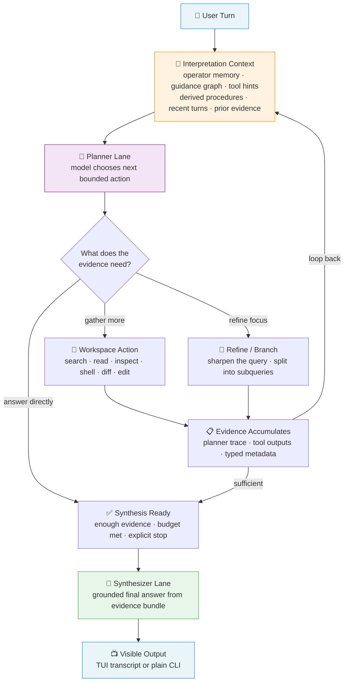
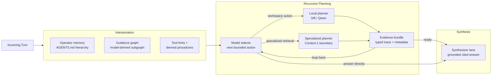
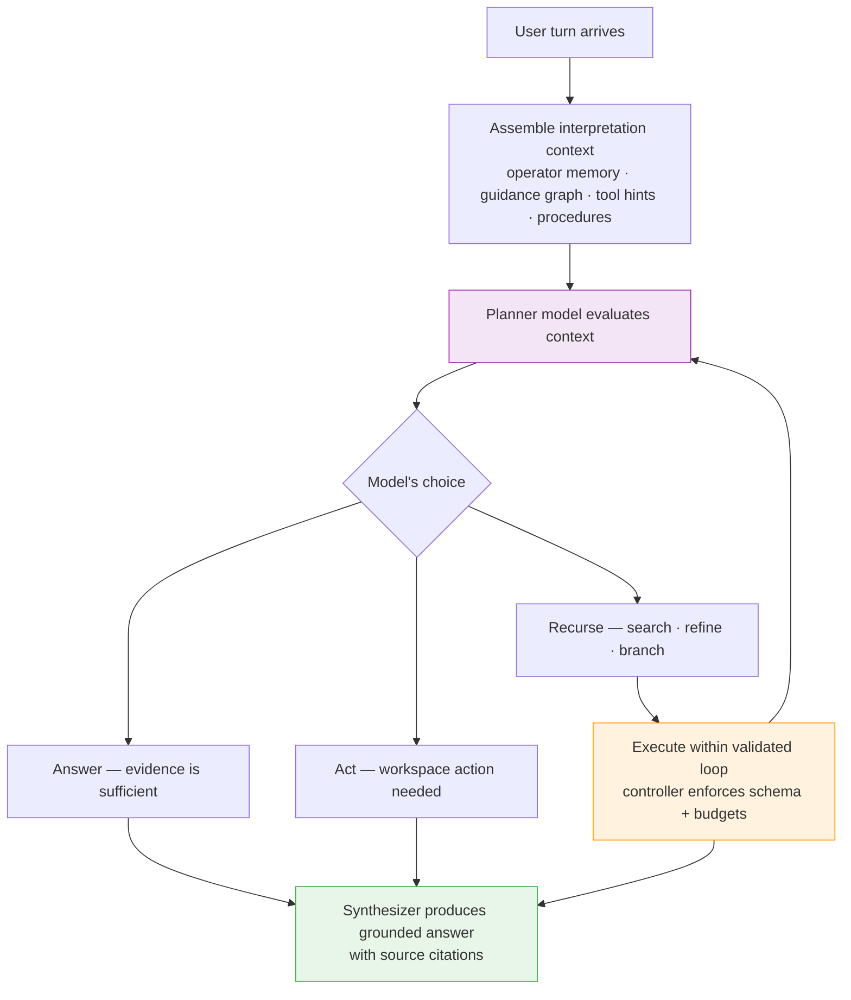
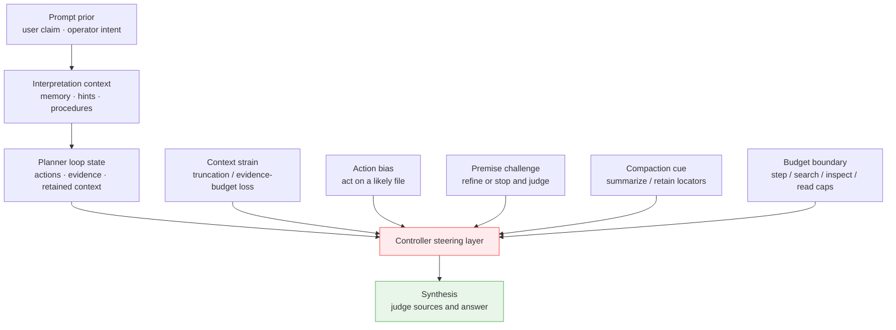
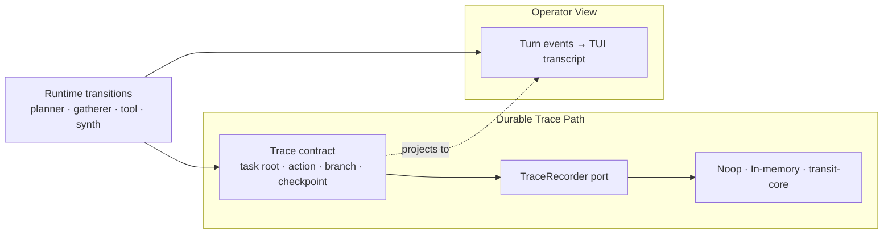
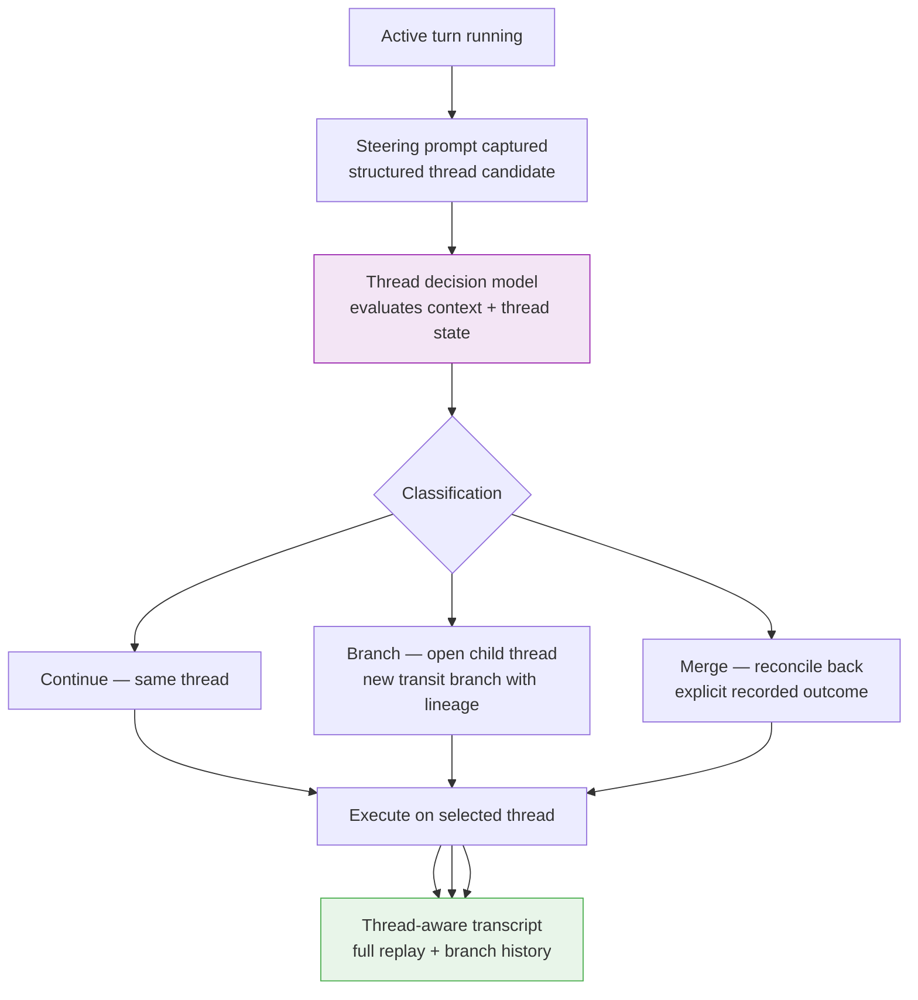

# Paddles: Recursive In-Context Planning Harness

[](.keel/README.md)
[](https://github.com/spoke-sh/paddles/actions/workflows/ci.yml)

> `paddles` is the mech suit around a local-first coding agent. Its backbone architecture is a recursive in-context planning harness: operator memory shapes turn interpretation, a planner model recursively gathers and refines evidence through bounded resource use, and a separate synthesizer model produces the final answer from that trace.

## Backbone Architecture

The architecture rests on four commitments:

- **Let the model reason first.** Interpretation context — operator memory, guidance graphs, tool hints, derived procedures — arrives before any routing decision. The model sees the full picture and chooses its own next action.
- **Earn the answer through recursive work.** Small models become dramatically more capable when the harness gives them bounded tools to gather evidence iteratively rather than answering in one shot.
- **Separate planning from synthesis.** Recursive context gathering and final answer generation are distinct workloads, each routed to the smallest model that excels at that role.
- **Keep every step visible.** The harness shows its recursive work — planner actions, evidence gathered, decisions made — so the operator always knows why an answer was produced.

### The Turn Loop

Every interaction follows the same recursive cycle. The harness assembles context, the planner model decides what to do next, the controller validates and executes that action, and the loop continues until evidence is sufficient for synthesis.



This is the heart of Paddles: a bounded recursive loop where the model drives its own investigation within safe guardrails. Each pass through the loop adds evidence, refines understanding, and brings the answer closer to ground truth.

### Model Routing

Each phase of the turn flows to the smallest model capable of that workload. A lightweight synthesizer handles final answers while a more capable planner drives the recursive investigation.



### The Recursive Harness in Practice

The primary mech-suit path assembles interpretation context first, then lets the planner model choose each bounded action. The controller validates, executes, and enforces budgets — the model drives direction, the controller ensures safety. Intent routing no longer comes from controller-side prompt token guesses; the planner decides when a turn should answer directly, investigate locally, or recurse.



### Steering Signals

Paddles does not rely on one generic control score. It runs a family of controller-owned steering signals that bias the loop when evidence starts to matter more than priors.



The systems serve different jobs:

- **Context strain** reports degraded assembled context when memory, retained artifacts, thread summaries, or evidence budgets are truncated.
- **Action bias** injects a steering-review note back into the planner when an edit-oriented turn keeps avoiding file action, so the model must judge whether to read, diff, or edit a likely target now.
- **Deterministic entity resolution** self-discovers authored workspace paths for edit-oriented hints before broad search or mutation and records whether the target resolved, remained ambiguous, or went missing.
- **Known-edit headroom** keeps edit turns bounded but leaves enough read/inspect/search budget to inspect a few candidate files before the workspace-editor boundary closes the loop.
- **Premise challenge** injects a steering-review note back into the planner when gathered sources start to outweigh the original premise, so the model must decide whether to stop, revise, or keep investigating.
- **Compaction cue** keeps the active context tight by summarizing or pruning low-value artifacts while preserving locators to the deeper record. Today that compaction policy is still mostly heuristic rather than fully model-judged.
- **Budget boundary** terminates recursive work when step, search, inspect, or read caps have been reached.

The important invariant is that steering signals become stronger as real evidence accumulates. A user claim can start the investigation, but gathered sources get the final say.

### Web Trace Routes

The web UI exposes three complementary trace routes:

- `/` — the forensic inspector, which is the precise source-of-truth view over recorded transit artifacts
- `/manifold` — the steering-gate manifold, which folds raw steering signals into three gate families (`evidence`, `convergence`, `containment`) and visualizes them as a temporal force field across time, gate family, and magnitude
- `/transit` — the snake-style turn-step trace, optimized for turn lineage and step sequencing

The important architectural limit is that the manifold route is still metaphorical. It is a projection over exact recorded trace artifacts, not an extra hidden reasoning layer. Every selected gate state must be able to reveal its underlying source record and route back to the precise forensic inspector.

When the selected source is a deterministic resolver outcome, the manifold readout now shows whether the target was `resolved`, `ambiguous`, or `missing`, along with the authored path or candidate set that produced that state. This keeps edit convergence visible without turning the manifold into a second editor.

The frontend is now staged through a shared Turborepo workspace:

- `apps/docs` owns the Docusaurus documentation site
- `apps/web` owns the TanStack-routed runtime application

The Rust server now serves the built React runtime directly on the primary web routes `/`, `/transit`, and `/manifold`. There is no iframe proxy layer and no secondary `/app` or `/legacy` route family. The product path, the browser E2E path, and the frontend build artifact now share the same route ownership.

The runtime browser contract is now projection-first:

- `GET /session/shared/bootstrap` returns the shared conversation id plus the canonical initial projection
- `GET /sessions/{id}/projection/events` is the single live stream for that session, carrying both projection rebuilds and turn-progress events
- the React runtime owns one shared projection store, so chat, transit, and manifold all render from the same conversation snapshot instead of stitching together panel-local fetch paths

### Trace Recording

Every recursive step produces typed trace records alongside the visible transcript. The UI is a projection; durable lineage lives in the recorder boundary.



### Threaded Conversations

Interactive sessions maintain one durable conversation root. When a steering prompt arrives mid-turn, the planner classifies it as continuation, child-thread, or merge-back — preserving full lineage for replay.



## What The Harness Delivers Today

The recursive harness runs as a bounded local-first runtime:

- **Interpretation-first routing** — every turn assembles operator memory, a model-derived guidance subgraph, read-only tool hints, and derived decision procedures before the planner chooses its first action
- **Model-driven action selection** — the planner chooses from `answer`, workspace actions (`search`, `list_files`, `read`, `inspect`, `shell`, `diff`, `write_file`, `replace_in_file`, `apply_patch`), `refine`, `branch`, or `stop`
- **Guidance-aware fallbacks** — fallback selection draws on command hints and decision procedures from foundational docs, and halts recursion when a procedure step has already resolved the request
- **Bounded recursive loop** — workspace actions, refinements, and branches all feed back into the planner until evidence is sufficient or budgets are met
- **Separate synthesis** — a distinct synthesizer lane produces the final grounded answer from the accumulated evidence bundle
- **Full-stream visibility** — a default TUI/event stream shows interpretation, first planner actions, retrieval, fallbacks, and grounded synthesis as they happen, while low-value direct-response bookkeeping stays behind higher verbosity
- **Shared verbosity contract** — one resolved `0/1/2/3` verbosity level governs both the TUI transcript and the web event stream: `0` is the default operational view, `1` adds info-tier planner metadata, `2` adds debug-tier routing/capability detail, and `3` enables trace diagnostics
- **Steering-signal control** — context strain and budget boundary remain controller-owned, while premise challenge and action bias now trigger recursive planner review passes over the current sources instead of hard-coded redirects
- **Durable trace lineage** — a paddles-owned trace contract with stable task/turn/record/branch/checkpoint ids, backed by a `TraceRecorder` boundary with noop, in-memory, and embedded `transit-core` adapters
- **Artifact envelopes** — prompts, tool I/O, evidence bundles, planner traces, and responses sit behind logical refs, ready for external storage when needed
- **Threaded conversations** — interactive sessions keep one durable root task with model-driven steering-thread decisions, structured thread candidates, explicit merge-back records, and full replay views
- **Four-tier context model** — context spans Inline, Transit, Sift, and Filesystem tiers with typed `ContextLocator` addressing and lazy cross-tier resolution through a `ContextResolver` port
- **Transit-native addressing** — truncated `ArtifactEnvelope` content carries typed locators to full records in transit or on disk, resolvable on demand without re-searching
- **Compaction planning with locators** — retained artifacts can be summarized or pruned while preserving locators for depth; the current compaction path is bounded and heuristic even though the interface is shaped for richer recursive self-assessment
- **Context strain signals** — a `StrainTracker` accumulates truncation events during context assembly and emits `ContextStrain` turn events so context degradation is visible in the event stream
- **Evidence-judgement stops** — when gathered sources weaken a user-stated failure premise, the controller re-enters the planner with a premise-challenge review note so the model can stop, revise, or continue explicitly
- **In-flight visibility** — the TUI inserts contextual "Planning...", "Synthesizing...", etc. rows after 2s of silence between events, so long model calls don't look stalled
- **Shared conversation primitives** — an internal workspace crate ([crates/paddles-conversation/src/lib.rs](/home/alex/workspace/spoke-sh/paddles/crates/paddles-conversation/src/lib.rs)) cleanly separates conversation/thread/session types from the main binary

### Growing Edges

A few areas are still maturing:

- **Sift-tier locator resolution** — typed `ContextLocator::Sift` values are emitted from retrieval; direct Sift resolver wiring is still being finalized
- **Automatic tier promotion** — content moves between tiers through explicit locators; automatic promotion/demotion policies are future work
- **Default recording policy** — embedded `transit-core` recording is available through the recorder boundary; the default runtime still uses noop until the policy slice lands
- **Context-1 integration** — `context-1` remains an explicit experimental boundary, available for opt-in use
- **Concurrent threading** — auto-threading is checkpoint-bounded and sequential today; true concurrent sibling generation is a future capability

## Design Principles

- **Interpretation shapes direction.** `AGENTS.md` memory influences what the planner investigates, how it prioritizes, and which procedures it follows.
- **The model drives, the controller guards.** The model selects its next bounded action from interpretation context; the controller validates, executes, and enforces budgets.
- **Conversation continuity is shared, not inferred twice.** Planner and answer lanes receive the same recent-turn and active-thread handoff, so follow-up turns do not reset just because the answer path changed.
- **Recursive work earns better answers.** Difficult workspace questions improve through iterative evidence gathering rather than one-shot generation.
- **Separation of concerns.** Planner and synthesizer are distinct roles, potentially using different models optimized for their respective workloads.
- **Context over hardcoding.** Keel, project artifacts, and board state flow through memory, search, and tool outputs — the harness stays general-purpose.
- **Local-first by default.** The core loop runs on local models. Heavier planner lanes are opt-in and degrade gracefully.
- **Visible execution.** Every recursive step is surfaced to the operator. The harness shows its work because transparency builds trust.

## Current Runtime Lanes

- The synthesizer lane defaults to `qwen-1.5b` on the local `sift` provider.
- Authored `paddles.toml` can define `[shared]`, `[synthesizer]`, and `[planner]` model sections. `shared` is the default fallback for both lanes when the specific section does not set its own provider/model.
- The planner lane defaults to the shared provider/model unless `--planner-provider <provider>` and `--planner-model <id>` select a different planner-capable lane.
- Remote providers can stay logged in side-by-side. In the TUI, use `/login <provider>` to add credentials for any supported provider and `/model` to inspect the active lanes or switch the shared runtime selection.
- OpenAI-compatible remote planners now select bounded workspace actions through native tool calls, while Paddles still executes those actions locally inside the repository harness.
- Successful `/model` changes persist to the machine-managed runtime state file at `~/.local/state/paddles/runtime-lanes.toml` so they survive restarts without rewriting authored `paddles.toml`.
- Local `sift` search artifacts now live under the machine-managed cache root at `~/.cache/paddles/sift/workspaces/<workspace-key>` instead of inside the repo workspace, so search does not index its own cache on restart.
- That runtime lane state overrides authored model-lane config on startup, while non-lane settings like `port` still come from layered config and CLI flags still win over everything.
- Inception is available through the same OpenAI-compatible HTTP lane used by the core remote providers. Authenticate with `/login inception`, then select the supported core model path with `/model inception mercury-2`.
- `mercury-2` remains the supported Inception planner/synthesizer chat model. Workspace edits still execute locally through the shared workspace editor boundary, so provider selection does not change `apply_patch` semantics.
- Provider-native streaming/diffusion views remain optional follow-on capabilities; they are still not required to use Inception in `paddles`.
- `qwen-coder-0.5b`, `qwen-coder-1.5b`, `qwen-coder-3b`, `qwen3.5-2b`, and `bonsai-8b` remain available as opt-in local planner or synthesizer variants on the `sift` provider.
- Local `sift` model preparation now goes through the stable crate-root `sift::prepare_model(...)` seam for compatible single-bundle local models. `bonsai-8b` now resolves back through Prism's published GGUF source and the upstream `metamorph` compatibility path instead of bypassing that seam with an unpacked-bundle download.
- That Bonsai preparation path is still a compatibility path, not native 1-bit execution. It makes the model usable on the current local runtime, but it does not preserve the original 1-bit efficiency of the published GGUF artifact.
- `sift-direct` is the default local gatherer/search backend used by planner `search` and `refine` actions.
- `paddles` owns recursive planning. `sift` executes direct retrieval only.
- Planner `search` and `refine` actions carry bounded retrieval mode and strategy into the gatherer boundary.
- Gatherer progress now reflects direct retrieval stages such as initialization, indexing, retrieval, and ranking.
- `context-1` remains an explicit experimental planner/gatherer boundary and stays fail-closed until its harness is real.

## Search And Retrieval

Search behavior is documented in [SEARCH.md](SEARCH.md).

Use that document when you need the retrieval boundary, provider names, capabilities, or constraints. The short version is:

- `paddles` plans
- `sift` retrieves
- `sift-direct` is the active local retrieval backend

## Foundational Documents

Use these in this order when reading the foundational stack:

1. [AGENTS.md](AGENTS.md) for operator guidance and the top-level working contract
2. [INSTRUCTIONS.md](INSTRUCTIONS.md) for the canonical Keel turn loop and checklists
3. [README.md](README.md) for the backbone architecture and navigation map
4. [CONSTITUTION.md](CONSTITUTION.md) for collaboration philosophy and bounds
5. [POLICY.md](POLICY.md) for operational commitments and runtime guarantees
6. [ARCHITECTURE.md](ARCHITECTURE.md) for the turn loop narrative and implementation map
7. [PROTOCOL.md](PROTOCOL.md) for communications and data contracts
8. [SEARCH.md](SEARCH.md) for search/retrieval behavior, constraints, and provider semantics
9. [CONFIGURATION.md](CONFIGURATION.md) for concrete lane/runtime configuration

Supplementary references:

- [STAGE.md](STAGE.md) for visual philosophy
- [RELEASE.md](RELEASE.md) for release process
- [.keel/adrs/](.keel/adrs/) for binding architecture decisions

This reading order is not the same thing as the decision hierarchy. For ambiguous design decisions, defer to ADRs first, then Constitution, Policy, Architecture, and current planning artifacts.

## Working With The Board

Use the raw `keel` CLI directly.

The normal operator rhythm is:

1. Orient with `keel health --scene`, `keel flow --scene`, and `keel doctor`.
2. Inspect with `keel mission next`, `keel pulse`, and `keel workshop`.
3. Pull one slice with `keel next --role <role>` or by following the active mission/story explicitly.
4. Ship the slice and land a sealing commit.
5. Re-orient immediately after the commit.

## Development Setup

Enter the dev shell:

```bash
nix develop
```

On Linux, the dev shell provides `chromium` for Playwright-driven browser tests.
On macOS, nixpkgs does not ship that package, so Playwright uses its own managed
browser download after `npm ci`.

Build and test:

```bash
just build
just test
just quality
```

`just quality` now covers both the Rust checks and the shared frontend workspace lint path. `just test` covers `cargo nextest`, the frontend workspace unit/build path, and browser E2E for the docs app plus the TanStack runtime on the primary product routes `/`, `/transit`, and `/manifold`. The runtime browser suite now keeps the page open, injects a turn from outside the page against the shared session, and verifies live transcript, transit, manifold, and reload continuity.

Check board health:

```bash
keel doctor
keel flow --scene
```

Run the interactive assistant:

```bash
just paddles --cuda
```

Use a heavier planner lane while keeping a lighter synthesizer:

```bash
paddles --model qwen-1.5b --planner-model qwen3.5-2b
```

One-shot prompt mode stays plain for scripts:

```bash
paddles --prompt "Summarize the current runtime lanes"
```

## REPL Memory

`paddles` reloads `AGENTS.md` memory on every turn from:

1. `/etc/paddles/AGENTS.md`
2. `~/.config/paddles/AGENTS.md`
3. every ancestor `AGENTS.md` from filesystem root to the current workspace

Later files are more specific. That memory now participates in turn interpretation before planner action selection, and additional guidance is loaded through a turn-time model-derived subgraph rooted at `AGENTS.md` rather than a hardcoded foundational file list.

## Why This Architecture

The mech suit raises the effective performance of smaller local models through recursive resource use. A small model with bounded tools and iterative evidence gathering consistently outperforms the same model answering in one shot.

That is the mech suit:

- **Human-authored guidance** shapes every turn through operator memory and derived procedures
- **Bounded recursive planning** lets the model investigate iteratively within safe guardrails
- **Explicit evidence accumulation** grounds answers in real workspace artifacts
- **Separate final synthesis** optimizes each phase independently
- **Visible execution** makes every decision transparent and auditable

## License

MIT. See [LICENSE](LICENSE).
