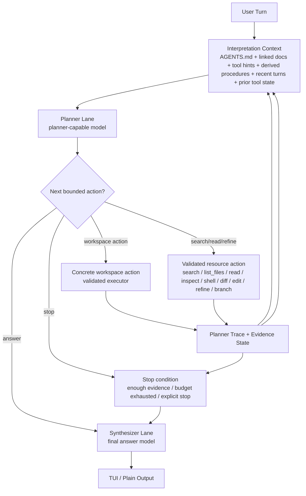
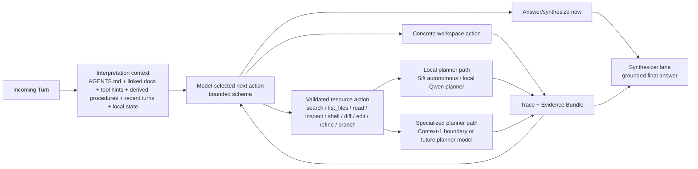
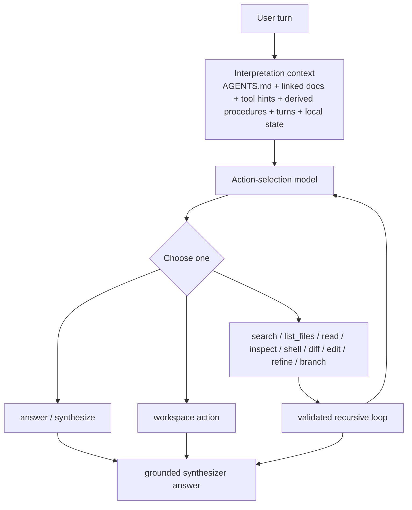
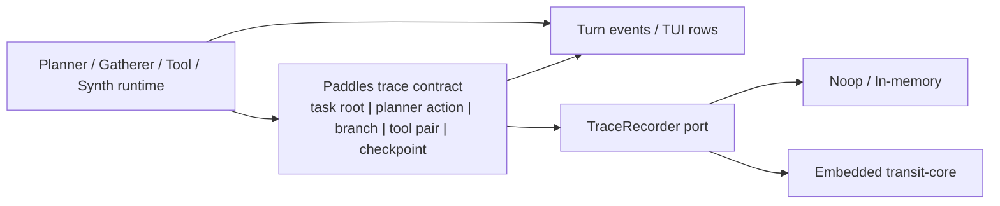
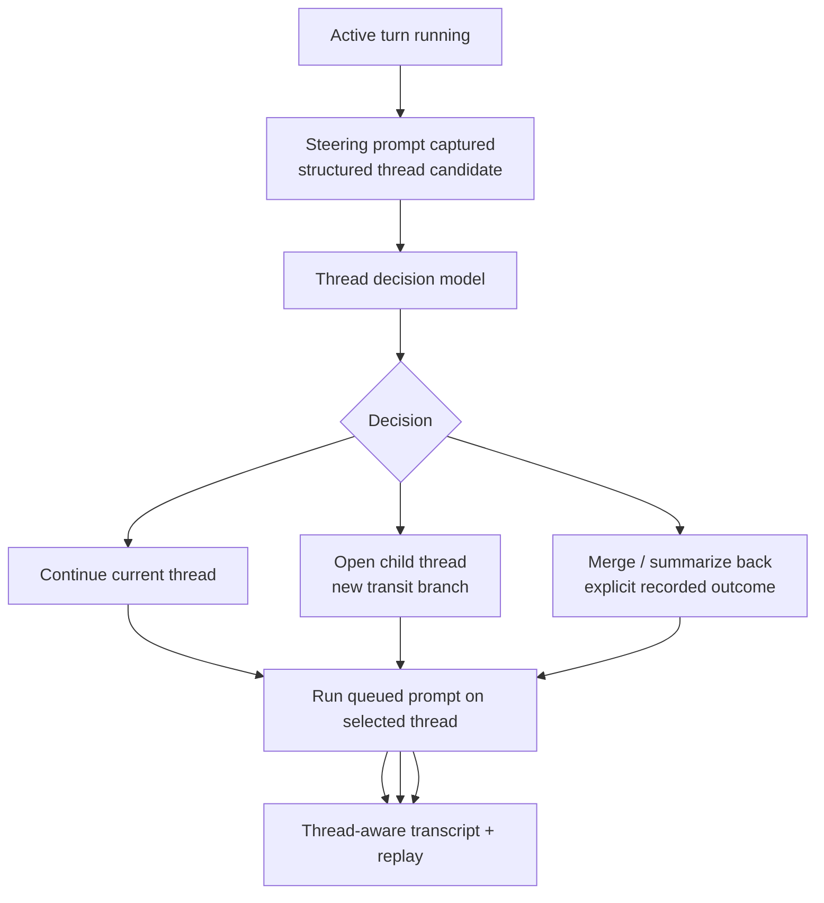

# Paddles: Recursive In-Context Planning Harness

[](LICENSE)
[](https://nixos.org/guides/how-nix-works)
[](.keel/README.md)

> `paddles` is the mech suit around a local-first coding agent. Its backbone architecture is a recursive in-context planning harness: operator memory shapes turn interpretation, a planner model recursively gathers and refines evidence through bounded resource use, and a separate synthesizer model produces the final answer from that trace.

> Foundational stack position: `3/8`
> This is the repository entrypoint and navigation hub. In the formal foundational reading order it follows [AGENTS.md](AGENTS.md) and [INSTRUCTIONS.md](INSTRUCTIONS.md), then leads into [CONSTITUTION.md](CONSTITUTION.md).

## Backbone Architecture

The central idea is simple:

- do not hardcode domain-specific turn types as the primary reasoning engine
- do not let controller heuristics commit the route before the model has seen interpretation context and chosen its next bounded action
- do not ask one small model to answer before it has done enough recursive context work
- do not treat retrieval and final answering as the same workload

Instead, `paddles` should behave like a bounded recursive harness.

### Recursive Loop



### Model Routing

Routing is workload-specific. The point is not to find one default model for everything. The point is to route each phase of the turn to the smallest capable lane.



### Delivered Backbone Step

The primary mech-suit path now assembles interpretation context first and asks
the planner model to choose the first bounded action before the controller
commits to a route. The controller still owns schema validation, allowlists,
budgets, and fail-closed behavior, but it no longer heuristically decides the
initial path for normal turns.



### Recorder Boundary

Recursive turns now have a paddles-owned recorder seam beside transcript
rendering. The UI remains a projection; durable traces come from typed runtime
records.



### Threaded Interactive Sessions

Interactive sessions now keep one durable conversation root and let the planner
classify queued steering prompts into mainline continuation, child-thread
splits, or merge-back transitions.



## Current Implementation Snapshot

The repository now implements the recursive harness in a bounded local-first form.

Today, the runtime has:

- a planner lane that sees interpretation context before choosing the first bounded action
- hierarchical `AGENTS.md` reload plus linked foundational guidance excerpts, read-only command hints, and derived decision procedures at interpretation time
- a model-directed first action schema that can choose `answer`, concrete workspace actions (`search`, `list_files`, `read`, `inspect`, `shell`, `diff`, `write_file`, `replace_in_file`, `apply_patch`), `refine`, `branch`, or `stop`
- interpretation-aware fallback selection that prefers relevant command hints and derived decision procedures from foundational docs before generic search/stop
- evidence-aware fallback stopping that halts recursion once an interpretation-derived procedure step has already answered the current request
- a bounded recursive loop for concrete workspace actions, `refine`, `branch`, and `stop`
- a distinct synthesizer lane that answers from the resulting evidence bundle
- a default TUI/event stream that shows interpretation, planner actions, retrieval, fallbacks, and synthesis
- a paddles-owned trace contract with stable task/turn/record/branch/checkpoint ids
- an internal workspace crate for conversation/thread/session primitives in [crates/paddles-conversation/src/lib.rs](/home/alex/workspace/spoke-sh/paddles/crates/paddles-conversation/src/lib.rs), so the transit-facing conversation layer is no longer fused into the main binary crate
- a `TraceRecorder` boundary beside `TurnEventSink`, with `noop`, in-memory, and embedded `transit-core` adapters
- artifact envelopes for prompts, tool I/O, evidence bundles, planner traces, and final responses so larger payloads can move behind logical refs later
- interactive conversation sessions with one durable root task, model-driven steering-thread decisions, and explicit merge-back records
- structured thread candidates and thread replay views instead of opaque queued prompt strings

The remaining gaps are narrower now:

- legacy direct adapter helpers outside the main mech-suit service still contain heuristic intent inference and should not be treated as the backbone contract
- the recursive loop currently relies on the configured gatherer backend for workspace search rather than a richer unified resource graph
- the runtime defaults to `noop` recording today; embedded `transit-core` recording is available through the recorder boundary but is not yet the default CLI/runtime policy
- graph-mode gatherer traces still use inline envelopes today; the contract leaves room for external artifact refs, but no artifact store promotion policy exists yet
- `context-1` is still an explicit experimental boundary, not the default planner lane
- auto-threading remains bounded to safe checkpoints between turns; paddles does not yet run true concurrent local generation across sibling threads on one model session

## Design Principles

- `AGENTS.md` should influence interpretation, not just answer style.
- The model should choose the next bounded action from interpretation context; the controller should validate and execute it safely.
- Recursive context refinement should do the heavy lifting for difficult workspace questions.
- Planner and synthesizer are different roles and may use different models.
- Keel and other project-specific artifacts are context, not hardcoded product logic.
- Local-first remains the default. Heavier planner lanes must degrade safely.
- Operator-visible traces matter. The harness should show its recursive work.

## Current Runtime Lanes

- The synthesizer lane defaults to `qwen-1.5b`.
- The planner lane defaults to the synthesizer model unless `--planner-model <id>` selects a different planner-capable model.
- `qwen-coder-0.5b`, `qwen-coder-1.5b`, `qwen-coder-3b`, and `qwen3.5-2b` remain available as opt-in planner or synthesizer variants.
- `sift-autonomous` is the current local gatherer/search backend used by planner `search` and `refine` actions.
- Recursive planner `search` and `refine` actions now request bounded `graph` mode through that gatherer path instead of stopping at linear autonomous search.
- Graph-mode gatherer results preserve typed branch/frontier/node/edge metadata with stable ids in the evidence bundle and default event stream.
- `context-1` remains an explicit experimental planner/gatherer boundary and stays fail-closed until its harness is real.

## Foundational Documents

Use these in this order when reading the foundational stack:

1. [AGENTS.md](AGENTS.md) for operator guidance and the top-level working contract
2. [INSTRUCTIONS.md](INSTRUCTIONS.md) for the canonical Keel turn loop and checklists
3. [README.md](README.md) for the backbone architecture and navigation map
4. [CONSTITUTION.md](CONSTITUTION.md) for collaboration philosophy and bounds
5. [POLICY.md](POLICY.md) for runtime invariants and safety rules
6. [ARCHITECTURE.md](ARCHITECTURE.md) for the target/current implementation split
7. [PROTOCOL.md](PROTOCOL.md) for communications and data contracts
8. [CONFIGURATION.md](CONFIGURATION.md) for concrete lane/runtime configuration

Supplementary references:

- [STAGE.md](STAGE.md) for visual philosophy
- [RELEASE.md](RELEASE.md) for release process
- [.keel/adrs/](.keel/adrs/) for binding architecture decisions

This reading order is not the same thing as the decision hierarchy. For ambiguous design decisions, defer to ADRs first, then Constitution, Policy, Architecture, and current planning artifacts.

## Working With The Board

Use the raw `keel` CLI directly.

The normal operator rhythm is:

1. Orient with `keel health --scene`, `keel flow --scene`, and `keel doctor --status`.
2. Inspect with `keel mission next --status`, `keel pulse`, and `keel workshop`.
3. Pull one slice with `keel next --role <role>` or by following the active mission/story explicitly.
4. Ship the slice and land a sealing commit.
5. Re-orient immediately after the commit.

## Development Setup

Enter the dev shell:

```bash
nix develop
```

Build and test:

```bash
just build
just test
just quality
```

Check board health:

```bash
keel doctor --status
keel flow --scene
```

Run the interactive assistant:

```bash
just paddles --cuda
```

Use a heavier planner lane while keeping a lighter synthesizer:

```bash
paddles --model qwen-1.5b --planner-model qwen3.5-2b
```

One-shot prompt mode stays plain for scripts:

```bash
paddles --prompt "Summarize the current runtime lanes"
```

## REPL Memory

`paddles` reloads `AGENTS.md` memory on every turn from:

1. `/etc/paddles/AGENTS.md`
2. `~/.config/paddles/AGENTS.md`
3. every ancestor `AGENTS.md` from filesystem root to the current workspace

Later files are more specific. That memory now participates in turn interpretation before planner action selection, and linked foundational docs are pulled in as compact excerpts rather than late prompt-only baggage.

## Why This Architecture

The goal is to raise the effective performance of smaller local models through recursive resource use rather than by hardcoding project-specific turn classes or jumping immediately to a larger answer model.

That is the mech suit:

- human-authored guidance and architecture
- bounded recursive planning
- explicit evidence accumulation
- separate final synthesis
- visible execution

## License

MIT. See [LICENSE](LICENSE).
